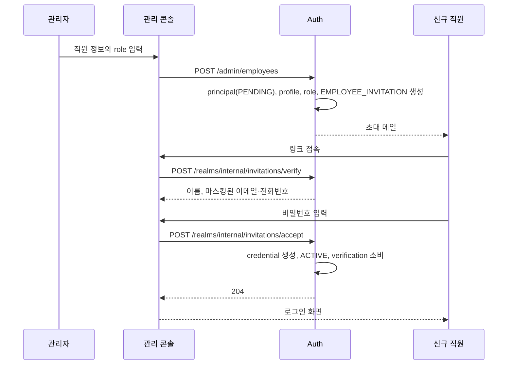
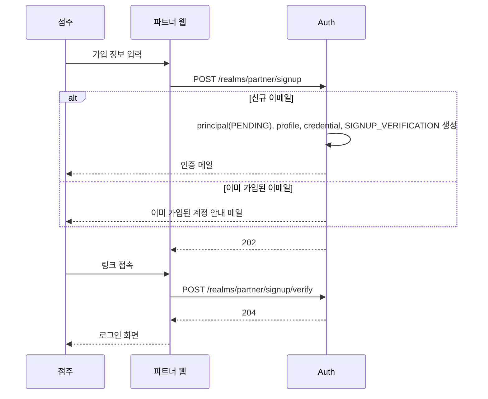
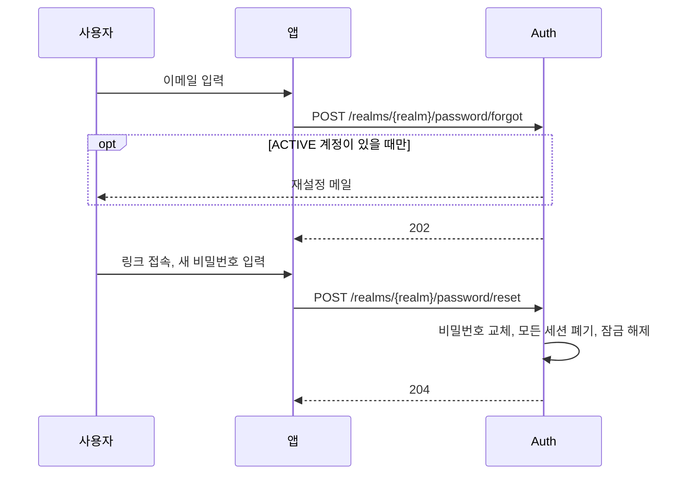

# 계정 API

가입, 초대 수락, 비밀번호 찾기, 본인 정보 관리 API입니다. 공통 규칙은 [conventions.md](conventions.md)를 따릅니다.

메일 링크는 Auth가 아니라 **앱 화면 주소**입니다. 앱이 링크의 토큰을 읽어 아래 API의 본문으로 보냅니다.

| 메일 | 링크 | 기준 주소 설정 |
|---|---|---|
| 직원 초대 | `{app}/invitation?token=...` | `AUTH_APP_URL_INTERNAL` |
| 가입 인증 | `{app}/signup/verify?token=...` | `AUTH_APP_URL_PARTNER` |
| 비밀번호 재설정 | `{app}/password/reset?token=...` (경로는 앱과 합의 필요) | realm에 맞는 앱 주소 |
| owner 양도 | `{app}/owner-transfer?token=...` (경로는 앱과 합의 필요) | `AUTH_APP_URL_INTERNAL` |

## 흐름

### 직원 초대



- 초대 생성은 [admin.md](admin.md#직원-초대)에 있습니다.
- owner 부트스트랩([GOV-11](../domain.md#8-관리-권한-규칙-gov))도 같은 초대를 만들고 같은 수락 API를 씁니다.

### 점주 가입



- 인증 전에 로그인하면 `EMAIL_NOT_VERIFIED`를 받고, 앱은 재발송을 안내합니다.
- 가입 직후 점주에게는 role이 없고, 매장 할당은 Store 서비스에서 합니다 ([api/internal.md 흐름](internal.md#점주-매장-할당)).

### 비밀번호 찾기·재설정



- 관리자도 같은 재설정 메일을 보낼 수 있습니다 ([admin.md](admin.md#비밀번호-재설정-메일-발송)).

## 엔드포인트

### 파트너 가입

`POST /realms/partner/signup`

| 인증 | 필요 role | realm |
|---|---|---|
| 없음 | - | `partner` |

**요청**

| 필드 | 타입 | 필수 | 설명 |
|---|---|---|---|
| `email` | string | ✅ | 로그인 이메일 |
| `password` | string | ✅ | [PWD-01](../domain.md#4-비밀번호-규칙-pwd)~[PWD-03](../domain.md#4-비밀번호-규칙-pwd) |
| `name` | string | ✅ | 이름 |
| `phone` | string | ✅ | 전화번호 |
| `address` | string | ✅ | 주소 |
| `businessNo` | string | | 사업자등록번호 |

**응답** `202 Accepted` (본문 없음)

**규칙** [LGN-04](../domain.md#5-로그인-규칙-lgn), [VER-01](../domain.md#7-verification-규칙-ver) (`SIGNUP_VERIFICATION`), [DOM-04](../domain.md#11-realm과-principal-type)

- 감사 로그: `PARTNER_SIGNED_UP`

### 가입 인증

`POST /realms/partner/signup/verify`

| 인증 | 필요 role | realm |
|---|---|---|
| 없음 | - | `partner` |

**요청**

| 필드 | 타입 | 필수 | 설명 |
|---|---|---|---|
| `token` | string | ✅ | 메일 링크의 토큰 |

**응답** `204 No Content`

**에러**

| code | 조건 |
|---|---|
| `VERIFICATION_EXPIRED` | 만료, 사용, 무효화된 토큰 |

**규칙** [VER-04](../domain.md#7-verification-규칙-ver), [VER-07](../domain.md#7-verification-규칙-ver)

- 감사 로그: `EMAIL_VERIFIED`

### 인증 메일 재발송

`POST /realms/partner/signup/resend`

| 인증 | 필요 role | realm |
|---|---|---|
| 없음 | - | `partner` |

**요청**

| 필드 | 타입 | 필수 | 설명 |
|---|---|---|---|
| `email` | string | ✅ | 가입한 이메일 |

**응답** `202 Accepted` (본문 없음)

**규칙** [LGN-04](../domain.md#5-로그인-규칙-lgn), [VER-03](../domain.md#7-verification-규칙-ver)

- `PENDING` 파트너일 때만 보냅니다. 계정이 없거나 이미 인증됐으면 보내지 않고 같은 응답을 줍니다.

### 초대 조회

`POST /realms/internal/invitations/verify`

| 인증 | 필요 role | realm |
|---|---|---|
| 없음 | - | `internal` |

**요청**

| 필드 | 타입 | 필수 | 설명 |
|---|---|---|---|
| `token` | string | ✅ | 초대 링크의 토큰 |

**응답** `200 OK`

```json
{
  "name": "김도윤",
  "maskedEmail": "ki***@dozycoffee.com",
  "maskedPhone": "010-****-5678",
  "expiresAt": "2026-09-27T05:00:00Z"
}
```

- `maskedPhone`은 전화번호가 없으면 `null`입니다.

**에러**

| code | 조건 |
|---|---|
| `VERIFICATION_EXPIRED` | 만료, 사용, 무효화된 초대 |

**규칙** [VER-05](../domain.md#7-verification-규칙-ver), [VER-06](../domain.md#7-verification-규칙-ver)

### 초대 수락

`POST /realms/internal/invitations/accept`

| 인증 | 필요 role | realm |
|---|---|---|
| 없음 | - | `internal` |

**요청**

| 필드 | 타입 | 필수 | 설명 |
|---|---|---|---|
| `token` | string | ✅ | 초대 링크의 토큰 |
| `password` | string | ✅ | [PWD-01](../domain.md#4-비밀번호-규칙-pwd)~[PWD-03](../domain.md#4-비밀번호-규칙-pwd) |

**응답** `204 No Content`

**에러**

| code | 조건 |
|---|---|
| `VERIFICATION_EXPIRED` | 만료, 사용, 무효화된 초대 |

**규칙** [VER-01](../domain.md#7-verification-규칙-ver) (`EMPLOYEE_INVITATION`)

- credential 생성, `ACTIVE` 전환, verification 소비를 한 트랜잭션에서 처리합니다.
- 자동 로그인하지 않습니다. 앱은 로그인 화면으로 보냅니다.
- 감사 로그: `INVITATION_ACCEPTED`

### 비밀번호 찾기

`POST /realms/{realm}/password/forgot`

| 인증 | 필요 role | realm |
|---|---|---|
| 없음 | - | `internal`, `partner` |

**요청**

| 필드 | 타입 | 필수 | 설명 |
|---|---|---|---|
| `email` | string | ✅ | 로그인 이메일 |

**응답** `202 Accepted` (본문 없음)

**규칙** [LGN-04](../domain.md#5-로그인-규칙-lgn), [VER-01](../domain.md#7-verification-규칙-ver) (`PASSWORD_RESET`), [VER-03](../domain.md#7-verification-규칙-ver)

- `ACTIVE` 계정에만 보냅니다.

### 비밀번호 재설정

`POST /realms/{realm}/password/reset`

| 인증 | 필요 role | realm |
|---|---|---|
| 없음 | - | `internal`, `partner` |

**요청**

| 필드 | 타입 | 필수 | 설명 |
|---|---|---|---|
| `token` | string | ✅ | 재설정 링크의 토큰 |
| `newPassword` | string | ✅ | [PWD-01](../domain.md#4-비밀번호-규칙-pwd)~[PWD-03](../domain.md#4-비밀번호-규칙-pwd) |

**응답** `204 No Content`

**에러**

| code | 조건 |
|---|---|
| `VERIFICATION_EXPIRED` | 만료, 사용, 무효화된 토큰 |

**규칙** [PWD-07](../domain.md#4-비밀번호-규칙-pwd)

- 토큰의 principal이 경로의 realm과 맞지 않으면 `VERIFICATION_EXPIRED`입니다.
- 감사 로그: `PASSWORD_RESET`

### 내 정보 수정

`PATCH /realms/{realm}/me`

| 인증 | 필요 role | realm |
|---|---|---|
| access token (사용자) | - | `internal`, `partner` |

**요청** 보낸 필드만 수정합니다.

| 필드 | 타입 | 필수 | 설명 |
|---|---|---|---|
| `name` | string | | 이름 |
| `phone` | string | | 전화번호 |
| `address` | string | | 주소 |
| `businessNo` | string | | 사업자등록번호. 파트너만 |

**응답** `200 OK`. [내 정보](auth.md#내-정보)와 같은 형식

**에러**

| code | 조건 |
|---|---|
| `VALIDATION_FAILED` | 직원이 `businessNo`를 보냄, `email`을 보냄 |

**규칙** [ACC-07](../domain.md#3-계정-상태-규칙-acc)

- 비밀번호는 [비밀번호 변경](auth.md#비밀번호-변경)으로 바꿉니다.
- 감사 로그: `PROFILE_UPDATED` (바뀐 필드 이름만, [AUD-07](../domain.md#11-감사와-알림-aud))

### 파트너 탈퇴

`POST /realms/partner/me/deactivate`

| 인증 | 필요 role | realm |
|---|---|---|
| access token (사용자) | - | `partner` |

**요청**

| 필드 | 타입 | 필수 | 설명 |
|---|---|---|---|
| `password` | string | ✅ | 현재 비밀번호 (본인 확인) |

**응답** `204 No Content`. 쿠키 삭제 헤더 포함

**에러**

| code | 조건 |
|---|---|
| `CURRENT_PASSWORD_MISMATCH` | 비밀번호 불일치 |
| `TOO_MANY_ATTEMPTS` | 비밀번호 확인 실패 반복 |

**규칙** [ACC-04](../domain.md#3-계정-상태-규칙-acc), [PWD-08](../domain.md#4-비밀번호-규칙-pwd), [INT-02](../domain.md#10-서비스-연계-규칙-int)

- 감사 로그: `ACCOUNT_DEACTIVATED` (`detail.via = "self"`)
