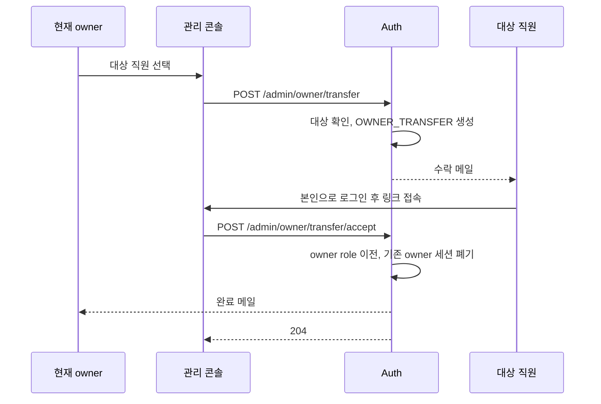

# 관리 API

관리 콘솔이 쓰는 `/admin/**` API입니다. 공통 규칙은 [conventions.md](conventions.md)를 따릅니다.

- 인증은 모두 "access token (관리)"입니다 ([conventions.md §2](conventions.md#2-인증-방식)). 표의 "필요 role" 중 하나가 있어야 합니다.
- 대상 계정에 대한 보호 규칙은 [GOV-02](../domain.md#8-관리-권한-규칙-gov), [GOV-03](../domain.md#8-관리-권한-규칙-gov)을 따르며, 위반은 `PROTECTED_ACCOUNT`입니다.
- owner 알림 대상은 [AUD-01](../domain.md#11-감사와-알림-aud)의 action으로 정해집니다.

## 흐름

### owner 양도



규칙은 [GOV-09](../domain.md#8-관리-권한-규칙-gov)를 따릅니다.

## 1. 직원

### 직원 초대

`POST /admin/employees`

| 필요 role |
|---|
| `auth:owner`, `auth:admin` |

**요청**

| 필드 | 타입 | 필수 | 설명 |
|---|---|---|---|
| `email` | string | ✅ | 로그인 이메일 |
| `name` | string | ✅ | 이름 |
| `phone` | string | | 전화번호 |
| `address` | string | | 주소 |
| `roles` | string[] | | 함께 부여할 role (`{audience}:{code}`) |

**응답** `201 Created`

```json
{ "principalId": 42, "status": "PENDING", "invitationExpiresAt": "2026-09-27T05:00:00Z" }
```

**에러**

| code | 조건 |
|---|---|
| `FORBIDDEN` | admin이 `auth:admin` 지정, `auth:owner` 지정 ([GOV-05](../domain.md#8-관리-권한-규칙-gov)) |
| `NOT_FOUND` | 존재하지 않는 role |
| `DUPLICATE_EMAIL` | 이미 사용 중인 직원 이메일 |

**규칙** [VER-01](../domain.md#7-verification-규칙-ver) (`EMPLOYEE_INVITATION`), [GOV-06](../domain.md#8-관리-권한-규칙-gov), [GOV-07](../domain.md#8-관리-권한-규칙-gov)

- principal, profile, role 부여, verification 발급을 한 트랜잭션에서 처리하고, 메일은 커밋 후 보냅니다.
- 감사 로그: `EMPLOYEE_INVITED`, role을 지정했으면 `ROLE_GRANTED`

### 직원 목록

`GET /admin/employees`

| 필요 role |
|---|
| `auth:owner`, `auth:admin` |

**요청** 쿼리

| 이름 | 설명 |
|---|---|
| `status` | `PENDING`, `ACTIVE`, `SUSPENDED`, `DEACTIVATED` |
| `role` | 이 role을 가진 직원만 (예: `wms:inbound_manager`) |
| `q` | 이름 또는 이메일 검색어 |
| `page`, `size` | [conventions.md §3](conventions.md#3-성공-응답) |

**응답** `200 OK`

```json
{
  "items": [
    {
      "principalId": 42,
      "email": "kim@dozycoffee.com",
      "name": "김도윤",
      "status": "ACTIVE",
      "roles": ["wms:inbound_manager"],
      "createdAt": "2026-09-24T05:00:00Z"
    }
  ],
  "page": { "number": 0, "size": 20, "totalElements": 1, "totalPages": 1 }
}
```

### 직원 상세

`GET /admin/employees/{principalId}`

| 필요 role |
|---|
| `auth:owner`, `auth:admin` |

**응답** `200 OK`

```json
{
  "principalId": 42,
  "email": "kim@dozycoffee.com",
  "name": "김도윤",
  "phone": "010-1234-5678",
  "address": "서울시 ...",
  "status": "ACTIVE",
  "roles": ["wms:inbound_manager", "catalog:menu_editor"],
  "lockedUntil": null,
  "invitation": null,
  "createdAt": "2026-09-24T05:00:00Z",
  "updatedAt": "2026-09-24T05:00:00Z"
}
```

- `invitation`은 `PENDING`일 때만 `{ "expiresAt": "..." }`이고, 그 외에는 `null`입니다.

**에러**

| code | 조건 |
|---|---|
| `NOT_FOUND` | 없는 id, 직원이 아닌 principal |

- admin도 owner·admin 계정을 조회할 수 있습니다.

### 직원 정보 수정

`PATCH /admin/employees/{principalId}`

| 필요 role |
|---|
| `auth:owner`, `auth:admin` |

**요청** 보낸 필드만 수정합니다.

| 필드 | 타입 | 설명 |
|---|---|---|
| `name` | string | 이름 |
| `phone` | string \| null | `null`이면 삭제 |
| `address` | string \| null | `null`이면 삭제 |

**응답** `200 OK`. [직원 상세](#직원-상세)와 같은 형식

**에러**

| code | 조건 |
|---|---|
| `PROTECTED_ACCOUNT` | admin이 owner·admin 계정 수정 |
| `NOT_FOUND` | 없는 직원 |
| `INVALID_STATE` | `DEACTIVATED` 계정 |

**규칙** [ACC-07](../domain.md#3-계정-상태-규칙-acc)

- 감사 로그: `PROFILE_UPDATED`

### 초대 재발송

`POST /admin/employees/{principalId}/invitation`

| 필요 role |
|---|
| `auth:owner`, `auth:admin` |

**요청** 본문 없음

**응답** `202 Accepted`

```json
{ "invitationExpiresAt": "2026-09-27T05:00:00Z" }
```

**에러**

| code | 조건 |
|---|---|
| `PROTECTED_ACCOUNT` | admin이 owner·admin 계정의 초대 재발송 |
| `NOT_FOUND` | 없는 직원 |
| `INVALID_STATE` | `PENDING`이 아님 |

**규칙** [VER-03](../domain.md#7-verification-규칙-ver)

- 부트스트랩 owner의 초대는 재기동할 때도 재발급됩니다 ([GOV-11](../domain.md#8-관리-권한-규칙-gov)).

### 초대 취소

`DELETE /admin/employees/{principalId}/invitation`

| 필요 role |
|---|
| `auth:owner`, `auth:admin` |

**응답** `204 No Content`

**에러**

| code | 조건 |
|---|---|
| `PROTECTED_ACCOUNT` | admin이 owner·admin 계정의 초대 취소 |
| `NOT_FOUND` | 없는 직원 |
| `INVALID_STATE` | `PENDING`이 아님 |

**규칙** [ACC-06](../domain.md#3-계정-상태-규칙-acc)

- 감사 로그: `ACCOUNT_DEACTIVATED` (`detail.via = "invitation_cancelled"`)

## 2. 파트너

### 파트너 목록

`GET /admin/partners`

| 필요 role |
|---|
| `auth:owner`, `auth:admin` |

**요청** 쿼리 `status`, `q`(이름·이메일 검색어), `page`, `size`

**응답** `200 OK`

```json
{
  "items": [
    { "principalId": 7, "email": "owner@example.com", "name": "이점주", "status": "ACTIVE", "createdAt": "2026-09-24T05:00:00Z" }
  ],
  "page": { "number": 0, "size": 20, "totalElements": 1, "totalPages": 1 }
}
```

- 매장 할당 정보는 Store 서비스에 있어 포함하지 않습니다.

### 파트너 상세

`GET /admin/partners/{principalId}`

| 필요 role |
|---|
| `auth:owner`, `auth:admin` |

**응답** `200 OK`

```json
{
  "principalId": 7,
  "email": "owner@example.com",
  "name": "이점주",
  "phone": "010-1234-5678",
  "address": "서울시 ...",
  "businessNo": "123-45-67890",
  "status": "ACTIVE",
  "lockedUntil": null,
  "createdAt": "2026-09-24T05:00:00Z",
  "updatedAt": "2026-09-24T05:00:00Z"
}
```

**에러**

| code | 조건 |
|---|---|
| `NOT_FOUND` | 없는 id, 파트너가 아닌 principal |

### 파트너 정보 수정

`PATCH /admin/partners/{principalId}`

| 필요 role |
|---|
| `auth:owner`, `auth:admin` |

**요청** 보낸 필드만 수정합니다. `name`, `phone`, `address`, `businessNo`

**응답** `200 OK`. [파트너 상세](#파트너-상세)와 같은 형식

**에러**

| code | 조건 |
|---|---|
| `NOT_FOUND` | 없는 파트너 |
| `INVALID_STATE` | `DEACTIVATED` 계정 |

**규칙** [ACC-07](../domain.md#3-계정-상태-규칙-acc)

- 감사 로그: `PROFILE_UPDATED`

## 3. 계정 상태와 비밀번호

아래 API는 직원, 파트너, system client 모두에 씁니다.

### 계정 정지

`POST /admin/principals/{principalId}/suspend`

| 필요 role |
|---|
| `auth:owner`, `auth:admin` |

**요청**

| 필드 | 타입 | 필수 | 설명 |
|---|---|---|---|
| `reason` | string | ✅ | 감사 로그에 기록 |

**응답** `204 No Content`

**에러**

| code | 조건 |
|---|---|
| `PROTECTED_ACCOUNT` | owner 계정, admin이 admin 계정 정지 |
| `NOT_FOUND` | 없는 principal |
| `INVALID_STATE` | `ACTIVE`가 아님 |

**규칙** [ACC-03](../domain.md#3-계정-상태-규칙-acc), [SES-07](../domain.md#6-세션-규칙-ses)

- 감사 로그: `ACCOUNT_SUSPENDED`

### 정지 해제

`POST /admin/principals/{principalId}/reactivate`

| 필요 role |
|---|
| `auth:owner`, `auth:admin` |

**응답** `204 No Content`

**에러**

| code | 조건 |
|---|---|
| `PROTECTED_ACCOUNT` | admin이 owner·admin 계정 해제 |
| `NOT_FOUND` | 없는 principal |
| `INVALID_STATE` | `SUSPENDED`가 아님 |

- 계정 탈취로 정지했다면 해제 후 재설정 메일을 보내는 것을 권장합니다.
- 감사 로그: `ACCOUNT_REACTIVATED`

### 계정 비활성화

`POST /admin/principals/{principalId}/deactivate`

| 필요 role |
|---|
| `auth:owner`, `auth:admin` |

**요청**

| 필드 | 타입 | 필수 | 설명 |
|---|---|---|---|
| `reason` | string | ✅ | 감사 로그에 기록 |

**응답** `204 No Content`

**에러**

| code | 조건 |
|---|---|
| `PROTECTED_ACCOUNT` | owner 계정, admin이 admin 계정 비활성화 |
| `NOT_FOUND` | 없는 principal |
| `INVALID_STATE` | 이미 `DEACTIVATED` |

- `PENDING` 계정도 비활성화할 수 있습니다(예: 인증하지 않은 파트너). 직원 초대 취소는 [초대 취소](#초대-취소)를 씁니다.

**규칙** [ACC-04](../domain.md#3-계정-상태-규칙-acc), [CLI-04](../domain.md#9-system-client-규칙-cli)

- system client 폐기도 이 API로 합니다. 파트너 본인 탈퇴는 [파트너 탈퇴](account.md#파트너-탈퇴)입니다.
- 감사 로그: `ACCOUNT_DEACTIVATED`

### 비밀번호 재설정 메일 발송

`POST /admin/principals/{principalId}/password-reset`

| 필요 role |
|---|
| `auth:owner`, `auth:admin` |

**요청** 본문 없음

**응답** `202 Accepted` (본문 없음)

**에러**

| code | 조건 |
|---|---|
| `PROTECTED_ACCOUNT` | admin이 owner·admin 계정에 요청 |
| `NOT_FOUND` | 없는 principal |
| `INVALID_STATE` | `ACTIVE`가 아님, system client |

**규칙** [PWD-05](../domain.md#4-비밀번호-규칙-pwd), [VER-01](../domain.md#7-verification-규칙-ver) (`PASSWORD_RESET`), [VER-03](../domain.md#7-verification-규칙-ver)

- 메일을 보내는 것만으로는 비밀번호와 세션이 바뀌지 않습니다. 탈취가 의심되면 먼저 정지합니다.
- 감사 로그: `PASSWORD_RESET_REQUESTED`

## 4. role 부여

### role 부여

`POST /admin/principals/{principalId}/roles`

| 필요 role |
|---|
| `auth:owner`, `auth:admin` |

**요청**

| 필드 | 타입 | 필수 | 설명 |
|---|---|---|---|
| `roles` | string[] | ✅ | `{audience}:{code}` 목록 |

**응답** `204 No Content`

**에러**

| code | 조건 |
|---|---|
| `FORBIDDEN` | admin이 `auth:admin` 부여, `auth:owner` 부여 ([GOV-05](../domain.md#8-관리-권한-규칙-gov)) |
| `SELF_GRANT_NOT_ALLOWED` | 자기 자신에게 부여 |
| `PROTECTED_ACCOUNT` | admin이 owner·admin 계정에 부여 |
| `NOT_FOUND` | principal 또는 role 없음 |
| `INVALID_STATE` | 대상이 파트너, `SUSPENDED`, `DEACTIVATED` ([GOV-06](../domain.md#8-관리-권한-규칙-gov), [GOV-07](../domain.md#8-관리-권한-규칙-gov)) |

**규칙** [GOV-04](../domain.md#8-관리-권한-규칙-gov)~[GOV-08](../domain.md#8-관리-권한-규칙-gov), [SES-05](../domain.md#6-세션-규칙-ses)

- admin 임명도 이 API로 `auth:admin`을 부여합니다.
- 감사 로그: `ROLE_GRANTED` (새로 부여한 role만 `detail.roles`에)

### role 회수

`DELETE /admin/principals/{principalId}/roles/{role}`

| 필요 role |
|---|
| `auth:owner`, `auth:admin` |

**요청** 경로 변수 `role`은 `{audience}:{code}` (예: `/admin/principals/42/roles/wms:inbound_manager`)

**응답** `204 No Content`

**에러**

| code | 조건 |
|---|---|
| `FORBIDDEN` | admin이 `auth:admin` 회수, `auth:owner` 회수 |
| `PROTECTED_ACCOUNT` | admin이 owner·admin 계정에서 회수 |
| `NOT_FOUND` | principal 또는 role 정의 없음 |

**규칙** [GOV-05](../domain.md#8-관리-권한-규칙-gov), [GOV-08](../domain.md#8-관리-권한-규칙-gov), [SES-07](../domain.md#6-세션-규칙-ses)

- admin 해임도 이 API로 `auth:admin`을 회수합니다.
- 감사 로그: `ROLE_REVOKED` (가지고 있던 경우만)

## 5. role 정의와 audience

### role 목록

`GET /admin/roles`

| 필요 role |
|---|
| `auth:owner`, `auth:admin` |

**요청** 쿼리 `audience`(audience code, 선택)

**응답** `200 OK` (페이지 없음)

```json
{
  "items": [
    {
      "id": 11,
      "audience": "wms",
      "code": "inbound_manager",
      "fullCode": "wms:inbound_manager",
      "name": "입고 관리자",
      "description": "입고 등록·수정·확정",
      "isSystem": false,
      "grantedCount": 12
    }
  ]
}
```

- `grantedCount`는 이 role을 가진 principal 수입니다.

### role 등록

`POST /admin/roles`

| 필요 role |
|---|
| `auth:owner`, `auth:admin` |

**요청**

| 필드 | 타입 | 필수 | 설명 |
|---|---|---|---|
| `audience` | string | ✅ | audience code |
| `code` | string | ✅ | [DOM-03](../domain.md#11-realm과-principal-type) |
| `name` | string | ✅ | 표시용 이름 |
| `description` | string | | 설명 |

**응답** `201 Created`. [role 목록](#role-목록)의 항목과 같은 형식

**에러**

| code | 조건 |
|---|---|
| `NOT_FOUND` | audience 없음 |
| `ROLE_CODE_DUPLICATED` | 같은 audience에 같은 code |

**규칙** [GOV-13](../domain.md#8-관리-권한-규칙-gov)

- 감사 로그: `ROLE_DEFINED`

### role 수정

`PATCH /admin/roles/{roleId}`

| 필요 role |
|---|
| `auth:owner`, `auth:admin` |

**요청** `name`, `description`만 받습니다.

**응답** `200 OK`. [role 목록](#role-목록)의 항목과 같은 형식

**에러**

| code | 조건 |
|---|---|
| `VALIDATION_FAILED` | `code`나 `audience`를 보냄 |
| `FORBIDDEN` | system role |
| `NOT_FOUND` | 없는 role |

**규칙** [GOV-13](../domain.md#8-관리-권한-규칙-gov)

- 감사 로그: `ROLE_UPDATED`

### role 삭제

`DELETE /admin/roles/{roleId}`

| 필요 role |
|---|
| `auth:owner`, `auth:admin` |

**요청** 쿼리 `revokeAll` (기본 `false`). `true`면 부여된 모든 principal에서 회수한 뒤 삭제합니다.

**응답** `204 No Content`

**에러**

| code | 조건 |
|---|---|
| `FORBIDDEN` | system role |
| `NOT_FOUND` | 없는 role |
| `ROLE_IN_USE` | 부여된 principal이 있는데 `revokeAll=true`가 아님 |

**규칙** [GOV-13](../domain.md#8-관리-권한-규칙-gov)

- 앱은 `ROLE_IN_USE`를 받으면 영향 인원을 보여주고 확인을 받은 뒤 `revokeAll=true`로 다시 요청합니다.
- 감사 로그: 회수한 principal마다 `ROLE_REVOKED`, 마지막에 `ROLE_DELETED`

### audience 목록

`GET /admin/audiences`

| 필요 role |
|---|
| `auth:owner`, `auth:admin` |

**응답** `200 OK` (페이지 없음)

```json
{
  "items": [
    { "id": 1, "code": "wms", "name": "창고 관리", "description": null },
    { "id": 4, "code": "auth", "name": "인증", "description": null }
  ]
}
```

### audience 추가

`POST /admin/audiences`

| 필요 role |
|---|
| `auth:owner` |

**요청**

| 필드 | 타입 | 필수 | 설명 |
|---|---|---|---|
| `code` | string | ✅ | [DOM-03](../domain.md#11-realm과-principal-type). 변경 불가 |
| `name` | string | ✅ | 표시용 이름 |
| `description` | string | | 설명 |

**응답** `201 Created`

```json
{ "id": 5, "code": "order", "name": "주문", "description": null }
```

**에러**

| code | 조건 |
|---|---|
| `AUDIENCE_CODE_DUPLICATED` | 같은 code |

**규칙** [GOV-13](../domain.md#8-관리-권한-규칙-gov)

- 감사 로그: `AUDIENCE_CREATED`

## 6. system client

### system client 목록

`GET /admin/system-clients`

| 필요 role |
|---|
| `auth:owner`, `auth:admin` |

**응답** `200 OK` (페이지 없음)

```json
{
  "items": [
    {
      "principalId": 3,
      "clientId": "svc-store",
      "name": "Store 서비스",
      "status": "ACTIVE",
      "roles": ["auth:partner_reader"],
      "secretRotatedAt": "2026-09-24T05:00:00Z",
      "createdAt": "2026-09-24T05:00:00Z"
    }
  ]
}
```

- secret은 포함하지 않습니다. role 변경은 [role 부여](#role-부여)·[role 회수](#role-회수), 폐기는 [계정 비활성화](#계정-비활성화)로 합니다.

### system client 등록

`POST /admin/system-clients`

| 필요 role |
|---|
| `auth:owner`, `auth:admin` |

**요청**

| 필드 | 타입 | 필수 | 설명 |
|---|---|---|---|
| `clientId` | string | ✅ | [CLI-01](../domain.md#9-system-client-규칙-cli) |
| `name` | string | ✅ | 표시용 이름 |
| `roles` | string[] | | 부여할 일반 role |

**응답** `201 Created`

```json
{ "principalId": 3, "clientId": "svc-store", "clientSecret": "Zr8qL2mX..." }
```

**에러**

| code | 조건 |
|---|---|
| `FORBIDDEN` | system role 지정 ([GOV-06](../domain.md#8-관리-권한-규칙-gov)) |
| `NOT_FOUND` | 없는 role |
| `CLIENT_ID_DUPLICATED` | 같은 `clientId` |

**규칙** [CLI-02](../domain.md#9-system-client-규칙-cli), [CLI-04](../domain.md#9-system-client-규칙-cli)

- 감사 로그: `SYSTEM_CLIENT_REGISTERED`, role을 지정했으면 `ROLE_GRANTED`

### secret 재발급

`POST /admin/system-clients/{principalId}/secret`

| 필요 role |
|---|
| `auth:owner`, `auth:admin` |

**요청** 본문 없음

**응답** `200 OK`

```json
{ "clientSecret": "Qw4nV7pK..." }
```

**에러**

| code | 조건 |
|---|---|
| `NOT_FOUND` | 없는 system client |
| `INVALID_STATE` | `ACTIVE`가 아님 |

**규칙** [CLI-02](../domain.md#9-system-client-규칙-cli), [CLI-03](../domain.md#9-system-client-규칙-cli)

- 감사 로그: `CLIENT_SECRET_ROTATED`

## 7. owner 양도

### owner 양도 요청

`POST /admin/owner/transfer`

| 필요 role |
|---|
| `auth:owner` |

**요청**

| 필드 | 타입 | 필수 | 설명 |
|---|---|---|---|
| `targetPrincipalId` | number | ✅ | 대상 직원 |

**응답** `202 Accepted`

```json
{ "expiresAt": "2026-09-27T05:00:00Z" }
```

**에러**

| code | 조건 |
|---|---|
| `NOT_FOUND` | 대상 없음 |
| `INVALID_STATE` | 대상이 `ACTIVE` 직원이 아님, 자기 자신, 진행 중인 양도가 있음 |

**규칙** [GOV-09](../domain.md#8-관리-권한-규칙-gov), [VER-01](../domain.md#7-verification-규칙-ver) (`OWNER_TRANSFER`)

- 감사 로그: `OWNER_TRANSFER_REQUESTED`

### owner 양도 수락

`POST /admin/owner/transfer/accept`

| 필요 role |
|---|
| 없음 (internal realm의 employee 토큰. `aud` 검사 예외, [conventions.md §2](conventions.md#2-인증-방식)) |

**요청**

| 필드 | 타입 | 필수 | 설명 |
|---|---|---|---|
| `token` | string | ✅ | 수락 링크의 토큰 |

**응답** `204 No Content`

**에러**

| code | 조건 |
|---|---|
| `FORBIDDEN` | 로그인한 사용자가 양도 대상이 아님 |
| `VERIFICATION_EXPIRED` | 만료, 사용, 취소된 양도 |

**규칙** [GOV-09](../domain.md#8-관리-권한-규칙-gov), [GOV-10](../domain.md#8-관리-권한-규칙-gov)

- 새 owner는 다음 토큰 갱신부터 owner 권한을 갖습니다.
- 감사 로그: `OWNER_TRANSFERRED`

### owner 양도 취소

`DELETE /admin/owner/transfer`

| 필요 role |
|---|
| `auth:owner` |

**응답** `204 No Content`

**에러**

| code | 조건 |
|---|---|
| `NOT_FOUND` | 진행 중인 양도 없음 |

- 발송된 수락 링크는 무효가 됩니다.
- 감사 로그: `OWNER_TRANSFER_CANCELLED`

## 8. 감사 로그

### 감사 로그 조회

`GET /admin/audit-logs`

| 필요 role |
|---|
| `auth:owner` |

**요청** 쿼리

| 이름 | 설명 |
|---|---|
| `from`, `to` | 기간 (ISO 8601). 기본은 최근 `policy.audit-query-default-range` |
| `actorId` | 행위자 principal id |
| `targetType`, `targetId` | 대상 |
| `action` | action. 여러 개는 쉼표로 구분 |
| `page`, `size` | [conventions.md §3](conventions.md#3-성공-응답) |

**응답** `200 OK`

```json
{
  "items": [
    {
      "id": 1024,
      "occurredAt": "2026-09-24T05:00:00Z",
      "actorId": 12,
      "actorType": "employee",
      "action": "ROLE_GRANTED",
      "targetType": "PRINCIPAL",
      "targetId": "42",
      "detail": { "roles": ["wms:inbound_manager"] },
      "ip": "203.0.113.10"
    }
  ],
  "page": { "number": 0, "size": 20, "totalElements": 1, "totalPages": 1 }
}
```

**에러**

| code | 조건 |
|---|---|
| `VALIDATION_FAILED` | 기간 형식 오류, 기간이 `policy.audit-query-max-range` 초과 |

**규칙** [AUD-04](../domain.md#11-감사와-알림-aud)
