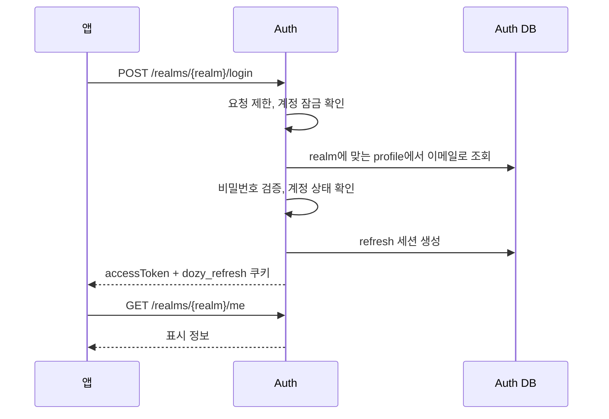
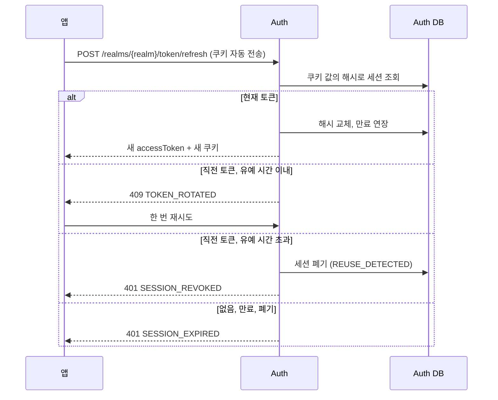

# 인증 API

로그인 세션을 다루는 API입니다. 공통 규칙은 [conventions.md](conventions.md)를 따릅니다.

## 흐름

### 로그인



검증 순서는 [LGN-01](../domain.md#5-로그인-규칙-lgn)을 따릅니다.

### 토큰 갱신



판정 규칙은 [SES-03](../domain.md#6-세션-규칙-ses)을 따릅니다.

## 엔드포인트

### 로그인

`POST /realms/{realm}/login`

| 인증 | 필요 role | realm |
|---|---|---|
| 없음 | - | `internal`, `partner` |

**요청**

| 필드 | 타입 | 필수 | 설명 |
|---|---|---|---|
| `email` | string | ✅ | 로그인 이메일 |
| `password` | string | ✅ | 비밀번호 |

**응답** `200 OK`

```http
Set-Cookie: dozy_refresh=...; HttpOnly; Secure; SameSite=Strict; Path=/realms/{realm}; Max-Age=...
```

```json
{ "accessToken": "eyJhbGciOiJSUzI1NiIs...", "tokenType": "Bearer", "expiresIn": 600 }
```

- `expiresIn`은 초 단위이며 `policy.access-token-ttl`입니다.

**에러**

| code | 조건 |
|---|---|
| `INVALID_CREDENTIALS` | 계정 없음, 비밀번호 불일치, 비활성화된 계정 |
| `EMAIL_NOT_VERIFIED` | 이메일 인증 전 파트너 |
| `ACCOUNT_SUSPENDED` | 정지된 계정 |
| `TOO_MANY_ATTEMPTS` | IP 요청 제한 또는 계정 잠금 |

**규칙** [LGN-01](../domain.md#5-로그인-규칙-lgn)~[LGN-03](../domain.md#5-로그인-규칙-lgn), [SES-01](../domain.md#6-세션-규칙-ses)

- `user_agent`, `ip`를 세션에 기록합니다.
- 감사 로그: `LOGIN_SUCCEEDED`, `LOGIN_FAILED`, 잠금이 걸리면 `ACCOUNT_LOCKED`

### 토큰 갱신

`POST /realms/{realm}/token/refresh`

| 인증 | 필요 role | realm |
|---|---|---|
| refresh 쿠키 | - | `internal`, `partner` |

**요청** 본문 없음

**응답** `200 OK`. 새 `dozy_refresh` 쿠키와 로그인과 같은 본문

**에러**

| code | 조건 |
|---|---|
| `TOKEN_ROTATED` | 교체 후 `policy.rotation-grace` 이내의 직전 토큰. 앱은 한 번 재시도 |
| `SESSION_EXPIRED` | 세션 없음·만료·폐기, 계정이 `ACTIVE`가 아님 |
| `SESSION_REVOKED` | 재사용 탐지로 방금 폐기함 |
| `FORBIDDEN` | 허용되지 않은 `Origin` |

**규칙** [SES-03](../domain.md#6-세션-규칙-ses)~[SES-05](../domain.md#6-세션-규칙-ses)

- 쿠키의 realm(경로)과 세션의 realm이 다르면 `SESSION_EXPIRED`입니다.
- 감사 로그: 재사용 탐지 시 `SESSION_REVOKED`

### 로그아웃

`POST /realms/{realm}/logout`

| 인증 | 필요 role | realm |
|---|---|---|
| refresh 쿠키 | - | `internal`, `partner` |

**요청** 본문 없음

**응답** `204 No Content`. 쿠키 삭제 헤더 포함

**에러**

| code | 조건 |
|---|---|
| `FORBIDDEN` | 허용되지 않은 `Origin` |

**규칙** [SES-06](../domain.md#6-세션-규칙-ses) (`LOGOUT`), [SES-07](../domain.md#6-세션-규칙-ses), [SES-08](../domain.md#6-세션-규칙-ses)

- 감사 로그: `SESSION_REVOKED`

### 내 정보

`GET /realms/{realm}/me`

| 인증 | 필요 role | realm |
|---|---|---|
| access token (사용자) | - | `internal`, `partner` |

**응답** `200 OK`

```json
{
  "principalType": "employee",
  "principalId": "0199a3c4-7b2e-7c1a-9f3d-2b6e8a1c4d5f",
  "name": "김도윤",
  "email": "kim@dozycoffee.com",
  "roles": ["wms:inbound_manager", "catalog:menu_editor"]
}
```

**규칙**

- `roles`는 DB의 현재 값이라 토큰의 role과 최대 `policy.access-token-ttl`만큼 다를 수 있습니다.
- 파트너는 `roles`가 빈 배열입니다.

### 비밀번호 변경

`POST /realms/{realm}/password/change`

| 인증 | 필요 role | realm |
|---|---|---|
| access token (사용자) | - | `internal`, `partner` |

**요청**

| 필드 | 타입 | 필수 | 설명 |
|---|---|---|---|
| `currentPassword` | string | ✅ | 현재 비밀번호 |
| `newPassword` | string | ✅ | 새 비밀번호 ([PWD-01](../domain.md#4-비밀번호-규칙-pwd)~[PWD-03](../domain.md#4-비밀번호-규칙-pwd)) |

**응답** `204 No Content`

**에러**

| code | 조건 |
|---|---|
| `CURRENT_PASSWORD_MISMATCH` | 현재 비밀번호 불일치 |
| `TOO_MANY_ATTEMPTS` | 현재 비밀번호 확인 실패 반복 |

**규칙** [PWD-06](../domain.md#4-비밀번호-규칙-pwd), [PWD-08](../domain.md#4-비밀번호-규칙-pwd)

- 현재 세션은 토큰의 `sid`로 식별합니다.
- 감사 로그: `PASSWORD_CHANGED`
