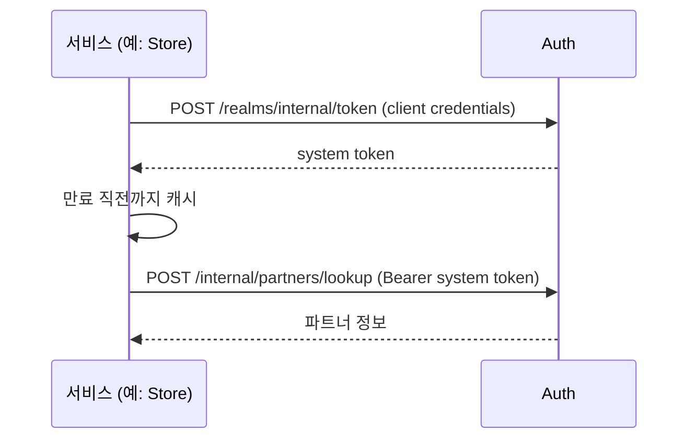
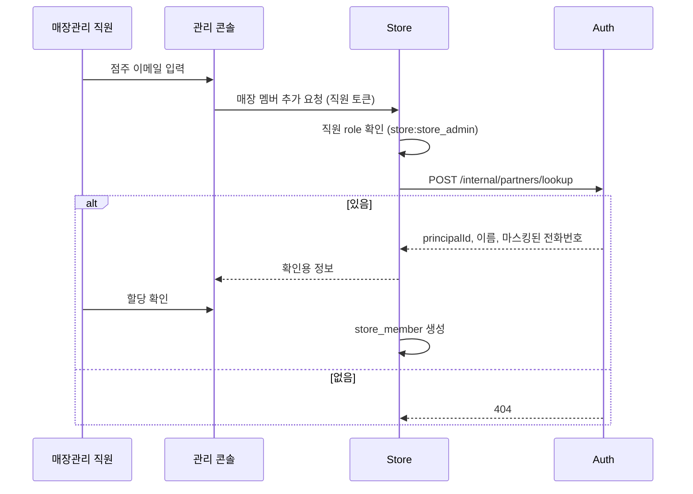

# 서비스용 API

다른 서비스(WMS, Catalog, Store)가 호출하는 API입니다. 공통 규칙은 [conventions.md](conventions.md)를 따릅니다.

## 흐름

### 서비스 간 호출



- 서비스는 스타터의 system token 클라이언트를 쓰면 발급·캐시·갱신이 자동입니다 ([starter.md §6](../starter.md#6-서비스-간-호출)).

### 점주 매장 할당



- Store API의 경로와 형식은 Store 서비스가 정합니다. Auth에는 아무것도 기록되지 않습니다 ([INT-02](../domain.md#10-서비스-연계-규칙-int)).

## 엔드포인트

### 서비스 토큰 발급

`POST /realms/internal/token`

| 인증 | 필요 role | realm |
|---|---|---|
| client 인증 | - | `internal` |

**요청** OAuth 2.0 client credentials

```http
POST /realms/internal/token
Authorization: Basic base64(clientId:clientSecret)
Content-Type: application/x-www-form-urlencoded

grant_type=client_credentials
```

**응답** `200 OK`

```json
{ "access_token": "eyJhbGciOiJSUzI1NiIs...", "token_type": "Bearer", "expires_in": 600 }
```

**에러** OAuth 2.0 표준 형식입니다 ([conventions.md §4](conventions.md#4-에러-응답)의 예외).

```json
{ "error": "invalid_client", "error_description": "Client authentication failed" }
```

| error | status | 조건 |
|---|---|---|
| `invalid_client` | 401 | client_id 또는 secret 불일치, `ACTIVE`가 아닌 client |
| `invalid_request` | 400 | 필수 파라미터 누락 |
| `unsupported_grant_type` | 400 | `client_credentials`가 아님 |

**규칙** [CLI-03](../domain.md#9-system-client-규칙-cli), [CLI-05](../domain.md#9-system-client-규칙-cli), [token.md §8](../token.md#8-system-token-발급)

- 요청 제한 대상이 아닙니다 ([conventions.md §8](conventions.md#8-요청-제한)).

### JWKS

`GET /.well-known/jwks.json`

| 인증 | 필요 role | realm |
|---|---|---|
| 없음 | - | - |

**응답** `200 OK`

```http
Cache-Control: public, max-age=300
```

```json
{
  "keys": [
    { "kty": "RSA", "kid": "dozy-2026-09", "use": "sig", "alg": "RS256", "n": "0vx7agoebGcQSuu...", "e": "AQAB" }
  ]
}
```

**규칙** [token.md §7](../token.md#7-jwks와-서명-키)

- `max-age`는 `policy.jwks-cache-max-age`입니다.
- 키 교체 기간에는 키가 여러 개 게시됩니다.
- 요청 제한 대상이 아닙니다 ([conventions.md §8](conventions.md#8-요청-제한)).

### 이메일로 파트너 조회

`POST /internal/partners/lookup`

| 인증 | 필요 role | realm |
|---|---|---|
| system token | `auth:partner_reader` | `internal` |

**요청**

| 필드 | 타입 | 필수 | 설명 |
|---|---|---|---|
| `email` | string | ✅ | 파트너 로그인 이메일 |

**응답** `200 OK`

```json
{ "principalId": "0199a3c5-1d4f-7a8b-b2c6-5e9f0a3d7c21", "name": "이점주", "maskedPhone": "010-****-5678" }
```

**에러**

| code | 조건 |
|---|---|
| `NOT_FOUND` | `ACTIVE` 파트너가 없음 |

**규칙** [INT-01](../domain.md#10-서비스-연계-규칙-int), [SEC-02](../domain.md#12-민감정보-sec)

- 이메일을 URL에 남기지 않기 위해 `POST`로 받습니다.
