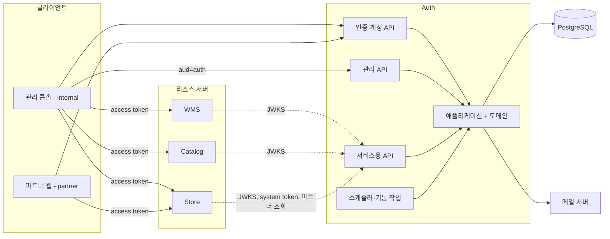

# 아키텍처

Auth의 구성요소, 책임 경계, 모듈과 코드 구조, 코드 규칙입니다.

## 1. 역할과 책임 경계

Auth는 **인증**만 담당합니다. "누구인가"와 "어떤 role을 가졌는가"를 보증하고, 그 정보로 무엇을 허용할지는 각 서비스가 정합니다.

| 판단 | 담당 | 근거 |
|---|---|---|
| 요청의 주체는 누구인가 | Auth(발급) → 서비스(서명 검증) | 토큰 |
| 이 서비스에 접근할 수 있는가 | 서비스 | `iss`, `aud` |
| 이 API를 호출할 수 있는가 | 서비스 | role |
| 이 리소스를 다룰 수 있는가 | 서비스 | 서비스 자체 데이터 (예: `store_member`) |
| 누가 어떤 role을 가졌는가 | Auth | `principal_role` |
| 누가 누구에게 role을 줄 수 있는가 | Auth | [GOV](domain.md#8-관리-권한-규칙-gov) 규칙 |

Auth가 하지 않는 것: 서비스별 API 인가, 리소스 소유권 판단, 로그인 화면 등 사용자 UI(각 앱이 제공).

## 2. 시스템 구성



| 구성요소 | 역할 | 명세 |
|---|---|---|
| 인증·계정 API | 로그인, 갱신, 가입, 초대 수락, 비밀번호 | [api/auth.md](api/auth.md), [api/account.md](api/account.md) |
| 관리 API | 계정·role·system client 관리, owner 양도, 감사 로그 | [api/admin.md](api/admin.md) |
| 서비스용 API | 서비스 토큰, JWKS, 파트너 조회 | [api/internal.md](api/internal.md) |
| 개발용 API | 개발용 토큰 (local·dev만) | [api/dev.md](api/dev.md) |
| 스케줄러 | 정리 배치, owner 일일 요약 알림 | [AUD-03](domain.md#11-감사와-알림-aud), [AUD-05](domain.md#11-감사와-알림-aud) |
| 기동 작업 | owner 부트스트랩 | [GOV-11](domain.md#8-관리-권한-규칙-gov) |
| 메일 | 초대, 가입 인증, 재설정, 양도, owner 알림 | [configuration.md](configuration.md#1-환경-변수) |

- Auth는 토큰을 발급하는 인가 서버이면서, 관리 API를 자기 토큰으로 보호하는 리소스 서버입니다.
- 서비스는 요청마다 Auth를 호출하지 않습니다. JWKS를 캐시해 직접 검증합니다.

## 3. 전제와 한계

- **앱과 Auth는 같은 상위 도메인(`.dozycoffee.com`)에 있어야 합니다.** refresh 쿠키 전달 조건입니다.
- **토큰 즉시 차단을 지원하지 않습니다** ([SES-07](domain.md#6-세션-규칙-ses)).
- **SSO를 지원하지 않습니다.** 앱마다 로그인합니다 ([ADR-0006](adr/0006-direct-login-api.md)).
- **요청 제한과 스케줄러는 인스턴스 단위입니다.** 인스턴스가 여러 대가 되면 요청 제한 한도가 대수만큼 늘고 스케줄러가 중복 실행됩니다. 다중화할 때 Redis와 ShedLock을 도입합니다 ([ADR-0024](adr/0024-in-memory-rate-limit-and-scheduler.md)).

## 4. 모듈

| 모듈 | 역할 | 의존 | JVM | 배포 |
|---|---|---|---|---|
| `auth-core` | 공유 타입과 상수 ([token.md §10](token.md#10-공유-타입-auth-core)) | 없음 (Kotlin 표준 라이브러리만) | 17 | GitHub Packages |
| `auth-server` | Auth 서버 | `auth-core` | 21 | 컨테이너 이미지 |
| `auth-spring-boot-starter` | 서비스용 자동 설정 ([starter.md](starter.md)) | `auth-core` | 17 | GitHub Packages |
| `auth-test` | 서비스 테스트 도구 ([starter.md §7](starter.md#7-auth-test)) | `auth-core`, `auth-spring-boot-starter` | 17 | GitHub Packages |

- 빌드 설정은 `build-logic`의 convention 플러그인(`dozy.kotlin-base`, `dozy.kotlin-library`, `dozy.spring-library`, `dozy.spring-app`)으로 모읍니다.
- 의존성 버전은 `gradle/libs.versions.toml`이 기준입니다.
- 라이브러리 모듈은 `explicitApi()`이며, Spring Boot BOM을 배포 메타데이터에 싣지 않습니다.
- 스타터·test는 `auth-server` 코드를 참조하지 않습니다.

## 5. auth-server 구조

헥사고날 구조를 계층별 패키지로 나눕니다 ([ADR-0023](adr/0023-hexagonal-layer-first.md)).

```text
com.dozycoffee.auth.server
├─ domain/                    비즈니스 규칙 (순수 Kotlin)
│   ├─ account/               principal, profile, 상태 전이
│   ├─ credential/            비밀번호 정책
│   ├─ session/               refresh 세션, rotation 판정
│   ├─ authorization/         role, owner·admin 보호 규칙
│   ├─ client/                system client
│   ├─ verification/          1회용 토큰, 목적별 정책
│   ├─ token/                 claim 구성, aud 결정
│   └─ audit/                 감사 이벤트
├─ application/
│   ├─ port/in/               UseCase 인터페이스와 Command (auth, admin, internal)
│   ├─ port/out/              외부로 나가는 인터페이스 (도메인별, mail, jwt, crypto)
│   └─ service/               UseCase 구현 (auth, admin, internal, system)
├─ adapter/
│   ├─ in/web/                컨트롤러 (auth, admin, internal, dev), error, ratelimit
│   ├─ in/scheduler/          정리 배치, 일일 요약
│   ├─ in/startup/            owner 부트스트랩
│   └─ out/                   persistence(Exposed), mail, jwt(Nimbus), crypto(Argon2)
└─ config/                    Spring Security, Exposed, 빈 조립
```

| 계층 | 역할 |
|---|---|
| `domain` | 규칙과 모델. 외부 기술을 모름 |
| `application/port/in` | 외부에서 호출할 수 있는 기능 목록 |
| `application/port/out` | 애플리케이션이 외부에 요구하는 기능 목록 |
| `application/service` | UseCase 구현. 여러 도메인과 포트를 엮고 트랜잭션 경계를 가짐 |
| `adapter/in` | 외부 요청을 UseCase 호출로 변환 |
| `adapter/out` | 포트를 실제 기술로 구현 |
| `config` | 빈 조립과 기술 설정 |

## 6. 의존 규칙

### 6.1 계층

| 계층 | 의존 가능 | 의존 금지 |
|---|---|---|
| `domain` | `auth-core` | Spring, Exposed, 다른 모든 계층 |
| `application` | `domain`, Spring의 `@Service`·`@Transactional` | `adapter`, Exposed, 웹 클래스 |
| `adapter/in` | `application/port/in`, `domain` | `adapter/out`, `application/service` |
| `adapter/out` | `application/port/out`, `domain` | `adapter/in`, `application/service` |
| `config` | 전부 | |

- 컨트롤러는 UseCase 인터페이스만 호출합니다. UseCase 구현은 아웃바운드 포트만 호출합니다.

### 6.2 도메인 간

| 종류 | 허용 |
|---|---|
| 다른 도메인의 동작 호출, 다른 도메인 객체를 필드로 보유 | ❌ |
| 다른 도메인을 ID로 참조 (`principalId: Long`) | ✅ |
| `auth-core` 타입 사용 | ✅ |
| 도메인 간 순환 참조 | ❌ |

- 여러 도메인이 함께 움직이면 UseCase가 순서대로 호출합니다.
- 한 도메인 규칙이 다른 도메인 정보를 필요로 하면, 객체 대신 필요한 값만 받습니다. 예: `ManagementPolicy`는 `Account`가 아니라 `Manager(id, grade)`, `ManagedTarget(id, grade)`를 받습니다.

### 6.3 아키텍처 테스트

아래 규칙을 Konsist로 CI에서 검사합니다 ([ADR-0025](adr/0025-konsist-architecture-tests.md)).

- 6.1의 계층 의존
- `domain`의 하위 패키지끼리 import 금지
- `@Transactional`은 `application/service`에만
- 이름 규칙 (§7)
- `auth-core`는 Spring을 import하지 않음

## 7. 이름 규칙

| 대상 | 규칙 | 예시 |
|---|---|---|
| 인바운드 포트 | `{동작}UseCase` | `LoginUseCase`, `SuspendAccountUseCase` |
| UseCase 입력 | `{동작}Command` | `SuspendAccountCommand` |
| UseCase 구현 | `{동작}Service` | `SuspendAccountService` |
| 아웃바운드 포트 | `{동작}{대상}Port` | `LoadAccountPort`, `RevokeSessionsPort` |
| 아웃바운드 구현 | `{대상}{기술}Adapter` | `AccountPersistenceAdapter`, `SmtpMailAdapter` |
| 컨트롤러 | `{영역}Controller` | `SessionController`, `AdminEmployeeController` |
| Exposed 테이블 | `{대상}Table` | `PrincipalTable`, `RefreshSessionTable` |

- 아웃바운드 포트는 동작 단위로 나눕니다. 한 어댑터가 같은 대상의 여러 포트를 구현해도 됩니다.

## 8. 포트 설계 규칙

| 규칙 | 좋은 예 | 나쁜 예 |
|---|---|---|
| 메서드는 저장소와 무관한 도메인 동작 | `rotate(presentedHash, newHash, now)` | `updateWhere(condition)` |
| 반환값은 도메인 타입 | `RefreshSession`, `RotateOutcome` | Exposed `ResultRow` |
| 원자적 동작은 메서드 하나 | `rotate`가 "현재 해시가 맞을 때만 교체"까지 책임 | 조회·비교·저장을 UseCase에서 조립 |
| 다른 도메인 테이블과 조인하지 않음 | 계정 정보는 계정 포트로 따로 조회 | `refresh_session JOIN employee_profile` |

- 세션 폐기는 `RevokeSessionsPort` 하나로 모읍니다.
- 메일 포트는 메일 종류와 값만 받습니다 (예: `InvitationMail(name, link, expiresAt)`). 문구와 템플릿은 메일 어댑터가 가집니다.

## 9. 코드 규칙

| 항목 | 규칙 | 이유 |
|---|---|---|
| DB 접근 | Exposed DSL만, `adapter/out/persistence` 안에서만 | 실행되는 SQL을 코드에 드러내기 위해 |
| 트랜잭션 | `application/service`에만 `@Transactional`. 여러 테이블을 바꾸면 한 트랜잭션 | 중간 상태 방지 |
| 메일 발송 | 트랜잭션 커밋 후 | 롤백된 작업의 메일 방지 |
| 현재 시각 | `Clock` 주입. `Instant.now()` 직접 호출 금지 | 만료·유예 시간 테스트 |
| 난수 | `SecureRandom`만 | 예측 방지 |
| 비교 | 토큰·해시는 상수 시간 비교 (`MessageDigest.isEqual`) | 타이밍 공격 방지 |
| 로그 | [SEC-03](domain.md#12-민감정보-sec) | |
| 테스트 대역 | MockK. 스프링 빈 대체는 springmockk | |
| 통합 테스트 | Testcontainers PostgreSQL | 실제 SQL 검증 |
| 포맷 | ktlint | |

### 9.1 에러 처리

- 규칙 위반은 도메인 예외로 던집니다. 예외는 에러 code와 HTTP 상태(숫자)를 가집니다. 도메인은 Spring에 의존하지 않으므로 `HttpStatus`를 쓰지 않습니다.
- `adapter/in/web/error`에서 모든 예외를 Problem Details로 변환합니다 ([api/conventions.md §4](api/conventions.md#4-에러-응답)).
- 에러 code는 [api/conventions.md §11](api/conventions.md#11-에러-코드)의 목록과 같은 이름을 씁니다.
- 결과가 여러 갈래인 정상 흐름(예: 토큰 갱신 판정)은 예외 대신 sealed class로 반환하고, UseCase에서 응답이나 예외로 바꿉니다.

```kotlin
abstract class AuthException(val code: String, val status: Int) : RuntimeException()
class ProtectedAccountException : AuthException("PROTECTED_ACCOUNT", 403)
```
