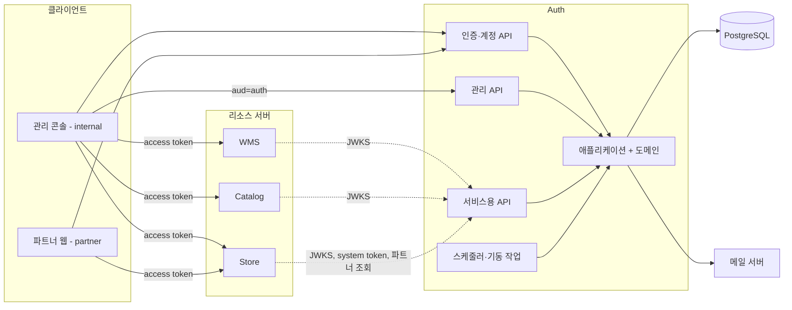

# 아키텍처

Auth의 구성요소, 책임 경계, 모듈과 코드 구조, 코드 규칙입니다.

## 1. 역할과 책임 경계

Auth는 **인증**만 담당합니다. "누구인가"와 "어떤 role을 가졌는가"를 보증하고, 그 정보로 무엇을 허용할지는 각 서비스가 정합니다.

| 판단 | 담당 | 근거 |
|---|---|---|
| 요청의 주체는 누구인가 | Auth(발급) → 서비스(서명 검증) | 토큰 |
| 이 서비스에 접근할 수 있는가 | 서비스 | `iss`, `aud` |
| 이 API를 호출할 수 있는가 | 서비스 | role |
| 이 리소스를 다룰 수 있는가 | 서비스 | 서비스 자체 데이터 (예: `store_member`) |
| 누가 어떤 role을 가졌는가 | Auth | `principal_role` |
| 누가 누구에게 role을 줄 수 있는가 | Auth | [GOV](domain.md#8-관리-권한-규칙-gov) 규칙 |

Auth가 하지 않는 것: 서비스별 API 인가, 리소스 소유권 판단, 로그인 화면 등 사용자 UI(각 앱이 제공).

## 2. 시스템 구성


```mermaid
flowchart LR
    subgraph Clients [클라이언트]
        Console[관리 콘솔 - internal]
        PartnerWeb[파트너 웹 - partner]
    end

    subgraph Auth [Auth]
        AuthAPI[인증·계정 API]
        AdminAPI[관리 API]
        InternalAPI[서비스용 API]
        Core[애플리케이션 + 도메인]
        Jobs[스케줄러·기동 작업]
    end

    subgraph Services [리소스 서버]
        WMS
        Catalog
        Store
    end

    DB[(PostgreSQL)]
    SMTP[메일 서버]

    Console --> AuthAPI
    PartnerWeb --> AuthAPI
    Console -->|aud=auth| AdminAPI
    AuthAPI --> Core
    AdminAPI --> Core
    InternalAPI --> Core
    Jobs --> Core
    Core --> DB
    Core --> SMTP

    Console -->|access token| WMS
    Console -->|access token| Catalog
    Console -->|access token| Store
    PartnerWeb -->|access token| Store
    WMS -.->|JWKS| InternalAPI
    Catalog -.->|JWKS| InternalAPI
    Store -.->|JWKS, system token, 파트너 조회| InternalAPI
```

| 구성요소 | 역할 | 명세 |
|---|---|---|
| 인증·계정 API | 로그인, 갱신, 가입, 초대 수락, 비밀번호 | [api/auth.md](api/auth.md), [api/account.md](api/account.md) |
| 관리 API | 계정·role·system client 관리, owner 양도, 감사 로그 | [api/admin.md](api/admin.md) |
| 서비스용 API | 서비스 토큰, JWKS, 파트너 조회 | [api/internal.md](api/internal.md) |
| 개발용 API | 개발용 토큰 (local·dev만) | [api/dev.md](api/dev.md) |
| 스케줄러 | 정리 배치, owner 일일 요약 알림 | [AUD-03](domain.md#11-감사와-알림-aud), [AUD-05](domain.md#11-감사와-알림-aud) |
| 기동 작업 | owner 부트스트랩 | [GOV-11](domain.md#8-관리-권한-규칙-gov) |
| 메일 | 초대, 가입 인증, 재설정, 양도, owner 알림 | [configuration.md](configuration.md#1-환경-변수) |

- Auth는 토큰을 발급하는 인가 서버이면서, 관리 API를 자기 토큰으로 보호하는 리소스 서버입니다.
- 서비스는 요청마다 Auth를 호출하지 않습니다. JWKS를 캐시해 직접 검증합니다.

## 3. 전제와 한계

- **앱과 Auth는 같은 상위 도메인(`.dozycoffee.com`)에 있어야 합니다.** refresh 쿠키 전달 조건입니다.
- **토큰 즉시 차단을 지원하지 않습니다** ([SES-07](domain.md#6-세션-규칙-ses)).
- **SSO를 지원하지 않습니다.** 앱마다 로그인합니다 ([ADR-0006](adr/0006-direct-login-api.md)).
- **요청 제한과 스케줄러는 인스턴스 단위입니다.** 인스턴스가 여러 대가 되면 요청 제한 한도가 대수만큼 늘고 스케줄러가 중복 실행됩니다. 다중화할 때 Redis와 ShedLock을 도입합니다 ([ADR-0024](adr/0024-in-memory-rate-limit-and-scheduler.md)).

## 4. 모듈

| 모듈 | 역할 | 의존 | JVM | 배포 |
|---|---|---|---|---|
| `auth-core` | 공유 타입과 상수 ([token.md §10](token.md#10-공유-타입-auth-core)) | 없음 (Kotlin 표준 라이브러리만) | 17 | GitHub Packages |
| `auth-server` | Auth 서버 | `auth-core`, `auth-spring-boot-starter` (받는 토큰의 검증, [ADR-0031](adr/0031-server-uses-starter-verification.md)) | 21 | 컨테이너 이미지 |
| `auth-spring-boot-starter` | 서비스용 자동 설정 ([starter.md](starter.md)) | `auth-core` | 17 | GitHub Packages |
| `auth-test` | 서비스 테스트 도구 ([starter.md §7](starter.md#7-auth-test)) | `auth-core`, `auth-spring-boot-starter` | 17 | GitHub Packages |

- 빌드 설정은 `build-logic`의 convention 플러그인(`dozy.kotlin-base`, `dozy.kotlin-library`, `dozy.spring-library`, `dozy.spring-app`)으로 모읍니다.
- 의존성 버전은 `gradle/libs.versions.toml`이 기준입니다.
- 라이브러리 모듈은 `explicitApi()`이며, Spring Boot BOM을 배포 메타데이터에 싣지 않습니다.
- 스타터·test는 `auth-server` 코드를 참조하지 않습니다.
- `auth-server`는 스타터의 검증기(디코더, 권한 변환기, `@CurrentPrincipal`)만 씁니다. 필터 체인과 401·403 응답은 서버가 직접 구성합니다 ([ADR-0031](adr/0031-server-uses-starter-verification.md)).

## 5. auth-server 구조

헥사고날 구조를 계층별 패키지로 나눕니다 ([ADR-0023](adr/0023-hexagonal-layer-first.md)). `in`은 Kotlin 예약어라 방향을 나타내는 패키지는 `inbound`/`outbound`로 씁니다 ([ADR-0029](adr/0029-inbound-outbound-packages.md)).

```text
com.dozycoffee.auth.server
├─ domain/                    비즈니스 규칙 (순수 Kotlin)
│   ├─ account/               principal, profile, 상태 전이
│   ├─ credential/            비밀번호 정책
│   ├─ session/               refresh 세션, rotation 판정
│   ├─ authorization/         role, owner·admin 보호 규칙
│   ├─ client/                system client
│   ├─ verification/          1회용 토큰, 목적별 정책
│   ├─ token/                 claim 구성, aud 결정
│   └─ audit/                 감사 이벤트
├─ application/
│   ├─ port/inbound/          UseCase 인터페이스와 Command (auth, admin, internal)
│   ├─ port/outbound/         외부로 나가는 인터페이스 (도메인별, mail, jwt, crypto)
│   └─ service/               UseCase 구현 (auth, admin, internal, system)
├─ adapter/
│   ├─ inbound/web/           컨트롤러 (auth, admin, internal, dev), error, ratelimit
│   ├─ inbound/scheduler/     정리 배치, 일일 요약
│   ├─ inbound/startup/       owner 부트스트랩
│   └─ outbound/              persistence(Exposed), mail, jwt(Nimbus), crypto(Argon2)
└─ config/                    Spring Security, Exposed, 빈 조립
```

| 계층 | 역할 |
|---|---|
| `domain` | 규칙과 모델. 외부 기술을 모름 |
| `application/port/inbound` | 외부에서 호출할 수 있는 기능 목록 |
| `application/port/outbound` | 애플리케이션이 외부에 요구하는 기능 목록 |
| `application/service` | UseCase 구현. 여러 도메인과 포트를 엮고 트랜잭션 경계를 가짐 |
| `adapter/inbound` | 외부 요청을 UseCase 호출로 변환 |
| `adapter/outbound` | 포트를 실제 기술로 구현 |
| `config` | 빈 조립과 기술 설정 |

## 6. 의존 규칙

### 6.1 계층

| 계층 | 의존 가능 | 의존 금지 |
|---|---|---|
| `domain` | `auth-core` | Spring, Exposed, 다른 모든 계층 |
| `application` | `domain`, Spring의 `@Service`·`@Transactional` | `adapter`, Exposed, 웹 클래스 |
| `adapter/inbound` | `application/port/inbound`, `domain` | `adapter/outbound`, `application/service` |
| `adapter/outbound` | `application/port/outbound`, `domain` | `adapter/inbound`, `application/service` |
| `config` | 전부 | |

- 컨트롤러는 UseCase 인터페이스만 호출합니다. UseCase 구현은 아웃바운드 포트만 호출합니다.

### 6.2 도메인 간

| 종류 | 허용 |
|---|---|
| 다른 도메인의 동작 호출, 다른 도메인 객체를 필드로 보유 | ❌ |
| 다른 도메인을 ID로 참조 (`principalId: UUID`) | ✅ |
| `domain` 바로 아래(하위 패키지 밖)의 공통 타입 사용 (예: `AuthException`(§9.1), `AuthPolicy`, `Email`, `OpaqueSecret`) | ✅ |
| `auth-core` 타입 사용 | ✅ |
| 도메인 간 순환 참조 | ❌ |

- 여러 도메인이 함께 움직이면 UseCase가 순서대로 호출합니다.
- 한 도메인 규칙이 다른 도메인 정보를 필요로 하면, 객체 대신 필요한 값만 받습니다. 예: `ManagementPolicy`는 `Account`가 아니라 `Manager(id, grade)`, `ManagedTarget(id, grade)`를 받습니다.

### 6.3 아키텍처 테스트

아래 규칙을 Konsist로 CI에서 검사합니다 ([ADR-0025](adr/0025-konsist-architecture-tests.md)). 테스트는 `auth-server/src/test/kotlin/com/dozycoffee/auth/server/architecture/ArchitectureTest.kt`에 있고, production 소스만 검사합니다.

- 6.1의 계층 의존 (`config`는 제외)
- `domain`은 Spring·Exposed를, `application`은 Exposed와 웹 클래스(`org.springframework.web`, `org.springframework.http`, `jakarta.servlet`)를 import하지 않음
- `domain`의 하위 패키지끼리 import 금지 (6.2)
- `@Transactional`은 `application/service`에만
- 이름 규칙 (§7): 접미사가 `UseCase`·`Command`면 `port/inbound`, `Port`면 `port/outbound`, `Adapter`면 `adapter/outbound`, `Table`이면 `adapter/outbound/persistence`, `Controller`면 `adapter/inbound/web`에 있어야 함
- `auth-core`는 Kotlin·Java 표준 라이브러리와 자기 패키지만 import

규칙은 import를 기준으로 검사합니다. 코드 안에서 패키지 전체 이름으로 직접 참조하면 잡히지 않으므로 import를 씁니다.

계층 의존은 Konsist `assertArchitecture`로 검사하며, 계층 패키지에 production 파일이 하나도 없으면 테스트가 실패합니다. 패키지 경로 오타로 규칙이 아무것도 검사하지 않는 것을 막기 위해서입니다.

## 7. 이름 규칙

| 대상 | 규칙 | 예시 |
|---|---|---|
| 인바운드 포트 | `{동작}UseCase` | `LoginUseCase`, `SuspendAccountUseCase` |
| UseCase 입력 | `{동작}Command` | `SuspendAccountCommand` |
| UseCase 구현 | `{동작}Service` | `SuspendAccountService` |
| 아웃바운드 포트 | `{동작}{대상}Port` | `LoadAccountPort`, `RevokeSessionsPort` |
| 아웃바운드 구현 | `{대상}{기술}Adapter` | `AccountPersistenceAdapter`, `SmtpMailAdapter` |
| 컨트롤러 | `{영역}Controller` | `SessionController`, `AdminEmployeeController` |
| Exposed 테이블 | `{대상}Table` | `PrincipalTable`, `RefreshSessionTable` |

- 아웃바운드 포트는 동작 단위로 나눕니다. 한 어댑터가 같은 대상의 여러 포트를 구현해도 됩니다.

## 8. 포트 설계 규칙

| 규칙 | 좋은 예 | 나쁜 예 |
|---|---|---|
| 메서드는 저장소와 무관한 도메인 동작 | `rotate(presentedHash, newHash, now)` | `updateWhere(condition)` |
| 반환값은 도메인 타입 | `RefreshSession`, `RotateOutcome` | Exposed `ResultRow` |
| 원자적 동작은 메서드 하나 | `rotate`가 "현재 해시가 맞을 때만 교체"까지 책임 | 조회·비교·저장을 UseCase에서 조립 |
| 다른 도메인 테이블과 조인하지 않음 | 계정 정보는 계정 포트로 따로 조회 | `refresh_session JOIN employee_profile` |

- 세션 폐기는 `RevokeSessionsPort` 하나로 모읍니다.
- 메일 포트(`SendMailPort`)는 메일 종류와 값만 받습니다 (예: `EmployeeInvitationMail(to, name, token, expiresAt)`). 문구, 템플릿, 링크는 메일 어댑터가 가집니다. 링크는 어댑터가 앱 화면 주소([api/account.md](api/account.md)의 링크 표)에 토큰을 붙여 만듭니다 ([VER-05](domain.md#7-verification-규칙-ver)).

## 9. 코드 규칙

| 항목 | 규칙 | 이유 |
|---|---|---|
| DB 접근 | Exposed DSL만, `adapter/outbound/persistence` 안에서만 | 실행되는 SQL을 코드에 드러내기 위해 |
| 트랜잭션 | `application/service`에만 `@Transactional`. 여러 테이블을 바꾸면 한 트랜잭션. 영속성 어댑터는 트랜잭션을 열지 않고 호출한 UseCase의 트랜잭션 안에서 실행됨 (Exposed `SpringTransactionManager`) | 중간 상태 방지 |
| 감사 로그 | 업무와 같은 트랜잭션에서 기록. 에러로 끝나도 남아야 하는 기록은 [§9.2](#92-감사-기록과-트랜잭션) | 업무와 기록이 함께 반영되거나 함께 사라지게 |
| 메일 발송 | 트랜잭션 커밋 후, 별도 스레드에서. 실패는 로그만 남김 ([§9.3](#93-메일-발송)) | 롤백된 작업의 메일 방지 |
| 현재 시각 | `Clock` 주입. `Instant.now()` 직접 호출 금지. 서버 `Clock`은 마이크로초 단위 | 만료·유예 시간 테스트. DB(`timestamptz`)가 마이크로초 아래를 반올림해 저장하므로 메모리와 DB 값을 맞춤 |
| 난수 | `SecureRandom`만 | 예측 방지 |
| 비교 | 토큰·해시는 상수 시간 비교 (`MessageDigest.isEqual`) | 타이밍 공격 방지 |
| 로그 | [SEC-03](domain.md#12-민감정보-sec) | |
| 테스트 | [testing.md](testing.md) | |
| 포맷 | ktlint | |

### 9.1 에러 처리

- 규칙 위반은 도메인 예외로 던집니다. 예외는 에러 code와 HTTP 상태(숫자)를 가집니다. 도메인은 Spring에 의존하지 않으므로 `HttpStatus`를 쓰지 않습니다.
- `adapter/inbound/web/error`에서 모든 예외를 Problem Details로 변환합니다 ([api/conventions.md §4](api/conventions.md#4-에러-응답)).
- `message`는 응답의 `detail`이 되므로 민감정보를 넣지 않습니다. 예외 처리기(`GlobalExceptionHandler`)는 도메인 예외, 검증 오류, Spring Security의 401·403(`AuthenticationEntryPoint`, `AccessDeniedHandler`가 처리기로 넘김), 그 밖의 예외(500, 내부 정보 비노출)를 같은 형식으로 응답하고, `TraceIdFilter`가 `X-Trace-Id`를 정합니다.
- 에러 code는 [api/conventions.md §11](api/conventions.md#11-에러-코드)의 목록과 같은 이름을 씁니다.
- 결과가 여러 갈래인 정상 흐름(예: 토큰 갱신 판정)은 예외 대신 sealed class로 반환하고, UseCase에서 응답이나 예외로 바꿉니다.

```kotlin
abstract class AuthException(val code: String, val status: Int, message: String) : RuntimeException(message)
class ProtectedAccountException : AuthException("PROTECTED_ACCOUNT", 403, "보호된 계정은 변경할 수 없습니다.")
```

### 9.2 감사 기록과 트랜잭션

감사 로그(`RecordAuditLogPort`)는 호출한 UseCase의 트랜잭션 안에서 기록합니다. 업무가 롤백되면 기록도 사라지므로, 일어나지 않은 일이 기록되지 않습니다.

`LOGIN_FAILED`, `ACCOUNT_LOCKED`처럼 요청이 에러 응답으로 끝나도 남아야 하는 기록은 그 에러와 함께 바뀐 상태(예: `failed_login_count`, `locked_until`)도 남아야 합니다. 그래서 별도 트랜잭션으로 기록만 따로 커밋하지 않고, 업무 트랜잭션 전체를 커밋합니다.

- 그 에러를 던지는 UseCase 메서드의 `@Transactional`에 `noRollbackFor`로 그 예외를 지정합니다. 예: 로그인은 `@Transactional(noRollbackFor = [InvalidCredentialsException::class])`
- 지정한 예외는 상태 변경과 감사 기록을 모두 마친 뒤 마지막에 던집니다. 그 예외로 끝나는 경로에는 커밋돼도 되는 변경만 둡니다.
- 지정하지 않은 예외(예상하지 못한 오류)는 기존대로 전부 롤백되고 기록도 남지 않습니다. 이 동작은 `AuditRecordTransactionTest`가 확인합니다.
- 기록만 `REQUIRES_NEW`로 따로 커밋하지 않습니다. 업무가 롤백돼도 기록이 남아 상태와 기록이 어긋나고, 요청 하나가 연결을 두 개 씁니다.

### 9.3 메일 발송

UseCase는 `SendMailPort.send`를 트랜잭션 안에서 호출하고, 발송 시점과 실패 처리는 메일 어댑터(`AfterCommitMailSender`)가 맡습니다.

- 트랜잭션 안에서 호출하면 그 트랜잭션에 `TransactionSynchronization`을 등록하고 **커밋 뒤(`afterCommit`)에** 보냅니다. 롤백되면 보내지 않습니다. 어댑터는 트랜잭션을 열지 않습니다.
- 트랜잭션 밖에서 호출하면(예: 기동 작업) 커밋을 기다리지 않고 보냅니다.
- 발송은 요청 스레드가 아니라 메일 전용 스레드에서 합니다. 응답이 SMTP 지연을 기다리지 않고, 메일을 보냈는지가 응답 시간으로 드러나지 않게 하기 위해서입니다 (예: 비밀번호 찾기는 `ACTIVE` 계정이 있을 때만 보냄).
- 발송에 실패하면 메일 종류와 예외만 경고 로그로 남기고 **다시 시도하지 않습니다.** 호출한 쪽에는 예외를 던지지 않으므로 업무는 그대로 성공합니다. 받는 사람은 재발송(초대 재발송, 비밀번호 찾기 다시 요청)으로 복구합니다. 대기열이 가득 차 받지 못한 메일도 같습니다.
- 로그에는 본문과 링크를 남기지 않습니다 ([SEC-03](domain.md#12-민감정보-sec)). 메일 값 객체의 토큰(`OpaqueSecret`)은 `toString`에서 가려집니다.
- 발송 대기 중인 메일은 메모리에만 있어 서버가 비정상 종료되면 사라집니다. 정상 종료할 때는 잠시 기다려 보냅니다. 발송 보장이 필요해지면 outbox 테이블을 검토합니다.
