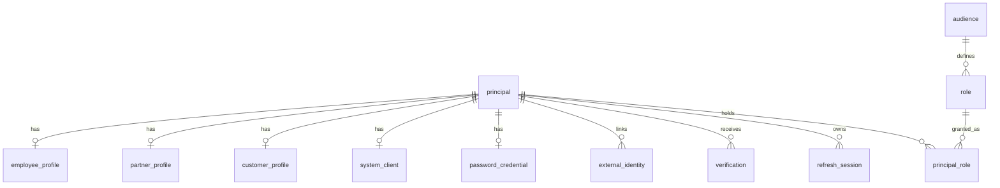

# 데이터 모델

Auth DB의 테이블, 컬럼, 인덱스, 제약입니다. Flyway 마이그레이션은 이 문서를 기준으로 작성합니다. 컬럼 값의 의미와 규칙은 [domain.md](domain.md)를 따릅니다.

## 1. 공통 규칙

| 항목 | 규칙 |
|---|---|
| DB | PostgreSQL 18 |
| 마이그레이션 | Flyway, `V{번호}__{설명}.sql` (예: `V1__init_schema.sql`). 적용된 파일은 수정하지 않음 |
| 이름 | snake_case, 테이블은 단수형 |
| 기본 키 | `id bigint GENERATED ALWAYS AS IDENTITY`. 단, `principal`은 `uuid DEFAULT uuidv7()`([ADR-0028](adr/0028-uuidv7-principal-id.md)), `refresh_session`은 `uuid DEFAULT gen_random_uuid()` |
| 외래 키 | `{대상}_id`. 삭제 동작은 기본값(RESTRICT) |
| 시각 | `timestamptz`, 컬럼 이름은 `_at`으로 끝남 |
| 코드값 | PostgreSQL enum 대신 `varchar` + `CHECK`. DB에는 모두 대문자로 저장 (`EMPLOYEE`, `INTERNAL`). API의 소문자 표기(`employee`, `internal`)로의 변환은 어댑터에서 |
| 이메일 | 입력값 그대로 저장, 유일성은 `lower(email)` 인덱스 |
| 해시 | 비밀번호는 argon2id 인코딩 문자열, 토큰류는 SHA-256 hex (`char(64)`) |

## 2. 관계



- principal 하나는 타입에 맞는 profile 하나만 가집니다.
- `audit_log`는 FK가 없습니다 ([AUD-06](domain.md#11-감사와-알림-aud)).

## 3. 테이블

### 3.1 principal

| 컬럼 | 타입 | NULL | 기본값 | 설명 |
|---|---|---|---|---|
| `id` | uuid | | `uuidv7()` | 토큰의 `principalId` |
| `type` | varchar(20) | | | `EMPLOYEE`, `SYSTEM`, `PARTNER`, `CUSTOMER`. 변경 불가 |
| `status` | varchar(20) | | | `PENDING`, `ACTIVE`, `SUSPENDED`, `DEACTIVATED` ([ACC-01](domain.md#3-계정-상태-규칙-acc)) |
| `failed_login_count` | int | | 0 | 연속 로그인 실패 횟수 |
| `locked_until` | timestamptz | ✅ | | 이 시각까지 로그인 차단 |
| `created_at` | timestamptz | | now() | |
| `updated_at` | timestamptz | | now() | |
| `deactivated_at` | timestamptz | ✅ | | `DEACTIVATED` 전환 시각 |

### 3.2 employee_profile

| 컬럼 | 타입 | NULL | 설명 |
|---|---|---|---|
| `principal_id` | uuid | | PK, FK → principal |
| `email` | varchar(254) | | 로그인 ID. `lower(email)` UNIQUE |
| `name` | varchar(50) | | |
| `phone` | varchar(20) | ✅ | |
| `address` | varchar(255) | ✅ | |
| `created_at` | timestamptz | | |
| `updated_at` | timestamptz | | |

### 3.3 partner_profile

| 컬럼 | 타입 | NULL | 설명 |
|---|---|---|---|
| `principal_id` | uuid | | PK, FK → principal |
| `email` | varchar(254) | | 로그인 ID. `lower(email)` UNIQUE |
| `name` | varchar(50) | | |
| `phone` | varchar(20) | ✅ | 가입 시 필수이지만 파기 후 NULL |
| `address` | varchar(255) | ✅ | 가입 시 필수이지만 파기 후 NULL |
| `business_no` | varchar(20) | ✅ | 사업자등록번호 |
| `created_at` | timestamptz | | |
| `updated_at` | timestamptz | | |

### 3.4 system_client

| 컬럼 | 타입 | NULL | 설명 |
|---|---|---|---|
| `principal_id` | uuid | | PK, FK → principal |
| `client_id` | varchar(100) | | UNIQUE ([CLI-01](domain.md#9-system-client-규칙-cli)) |
| `client_secret_hash` | char(64) | ✅ | secret의 SHA-256. 비활성화하면 NULL ([ACC-04](domain.md#3-계정-상태-규칙-acc)) |
| `name` | varchar(100) | | 표시용 이름 |
| `secret_rotated_at` | timestamptz | | 마지막 secret 발급 시각 |
| `created_at` | timestamptz | | |

### 3.5 password_credential

| 컬럼 | 타입 | NULL | 설명 |
|---|---|---|---|
| `principal_id` | uuid | | PK, FK → principal |
| `password_hash` | varchar(255) | | argon2id 인코딩 문자열 (파라미터 포함) |
| `changed_at` | timestamptz | | 마지막 변경 시각 |
| `created_at` | timestamptz | | |

- 초대 수락 전 직원, system client에는 행이 없습니다.

### 3.6 verification

| 컬럼 | 타입 | NULL | 기본값 | 설명 |
|---|---|---|---|---|
| `id` | bigint | | identity | |
| `principal_id` | uuid | | | FK → principal |
| `purpose` | varchar(30) | | | [VER-01](domain.md#7-verification-규칙-ver)의 purpose |
| `method` | varchar(10) | | | `EMAIL` (`SMS`는 추후) |
| `target` | varchar(254) | | | 발송한 주소 스냅샷 ([VER-08](domain.md#7-verification-규칙-ver)) |
| `token_hash` | char(64) | | | UNIQUE |
| `payload` | jsonb | ✅ | | 목적별 추가 데이터 |
| `attempt_count` | int | | 0 | 검증 시도 횟수 |
| `max_attempts` | int | ✅ | | 링크 토큰은 NULL |
| `expires_at` | timestamptz | | | |
| `consumed_at` | timestamptz | ✅ | | |
| `invalidated_at` | timestamptz | ✅ | | |
| `created_at` | timestamptz | | now() | |

- 부분 UNIQUE: `(principal_id, purpose) WHERE consumed_at IS NULL AND invalidated_at IS NULL` ([VER-03](domain.md#7-verification-규칙-ver))

### 3.7 audience

| 컬럼 | 타입 | NULL | 설명 |
|---|---|---|---|
| `id` | bigint | | PK |
| `code` | varchar(30) | | UNIQUE, `CHECK (code ~ '^[a-z][a-z0-9_]*$')` |
| `name` | varchar(100) | | |
| `description` | varchar(500) | ✅ | |
| `created_at` | timestamptz | | |

### 3.8 role

| 컬럼 | 타입 | NULL | 기본값 | 설명 |
|---|---|---|---|---|
| `id` | bigint | | identity | |
| `audience_id` | bigint | | | FK → audience |
| `code` | varchar(50) | | | `CHECK (code ~ '^[a-z][a-z0-9_]*$')` |
| `name` | varchar(100) | | | |
| `description` | varchar(500) | ✅ | | |
| `is_system` | boolean | | false | `auth:owner`, `auth:admin` |
| `created_by` | uuid | ✅ | | FK → principal. 마이그레이션으로 만든 role은 NULL |
| `created_at` | timestamptz | | now() | |
| `updated_at` | timestamptz | | now() | |

- UNIQUE `(audience_id, code)`

### 3.9 principal_role

| 컬럼 | 타입 | NULL | 설명 |
|---|---|---|---|
| `principal_id` | uuid | | PK, FK → principal |
| `role_id` | bigint | | PK, FK → role |
| `granted_by` | uuid | ✅ | FK → principal. 부트스트랩·수동 복구는 NULL |
| `granted_at` | timestamptz | | |

- 회수는 행 삭제이며, 이력은 감사 로그에 남깁니다.
- owner 유일성([GOV-10](domain.md#8-관리-권한-규칙-gov)): seed에서 `auth:owner` role의 id를 고정하고, `CREATE UNIQUE INDEX ... ON principal_role (role_id) WHERE role_id = {owner role id}`로 보장합니다.

### 3.10 refresh_session

| 컬럼 | 타입 | NULL | 설명 |
|---|---|---|---|
| `id` | uuid | | PK. 토큰의 `sid` |
| `principal_id` | uuid | | FK → principal |
| `realm` | varchar(20) | | `INTERNAL`, `PARTNER`, `CUSTOMER` |
| `current_token_hash` | char(64) | | UNIQUE |
| `previous_token_hash` | char(64) | ✅ | 직전 토큰 해시 |
| `rotated_at` | timestamptz | ✅ | 마지막 교체 시각 |
| `created_at` | timestamptz | | 최초 로그인 시각 |
| `last_used_at` | timestamptz | | 마지막 갱신 시각 |
| `expires_at` | timestamptz | | `policy.refresh-idle-ttl` 기준, `absolute_expires_at` 이하 |
| `absolute_expires_at` | timestamptz | | 최초 로그인 + `policy.refresh-absolute-ttl` |
| `revoked_at` | timestamptz | ✅ | |
| `revoke_reason` | varchar(30) | ✅ | [SES-06](domain.md#6-세션-규칙-ses)의 값 |
| `user_agent` | varchar(255) | ✅ | |
| `ip` | inet | ✅ | 로그인 시 IP |

- 인덱스: `previous_token_hash` (`WHERE previous_token_hash IS NOT NULL`), `principal_id` (`WHERE revoked_at IS NULL`)

**갱신 쿼리** ([SES-03](domain.md#6-세션-규칙-ses), [SES-04](domain.md#6-세션-규칙-ses))

```sql
UPDATE refresh_session
SET previous_token_hash = current_token_hash,
    current_token_hash  = :newHash,
    rotated_at          = :now,
    last_used_at        = :now,
    expires_at          = least(:now + :idleTtl, absolute_expires_at)
WHERE current_token_hash = :presentedHash
  AND revoked_at IS NULL
  AND expires_at > :now
RETURNING id, principal_id, realm;
```

- 1행이면 성공입니다. 0행이면 `previous_token_hash = :presentedHash`로 다시 조회해 판정합니다.
- `:now`는 DB의 `now()`가 아니라 애플리케이션 `Clock` 값입니다. 테스트에서 시간을 제어하기 위해서입니다.

### 3.11 audit_log

| 컬럼 | 타입 | NULL | 설명 |
|---|---|---|---|
| `id` | bigint | | PK |
| `occurred_at` | timestamptz | | |
| `actor_id` | uuid | ✅ | 행위자. 시스템 작업(부트스트랩, 배치)은 NULL |
| `actor_type` | varchar(20) | ✅ | 행위 시점의 principal type (`EMPLOYEE` 등) |
| `action` | varchar(50) | | [AUD-01](domain.md#11-감사와-알림-aud)의 action |
| `target_type` | varchar(30) | ✅ | `PRINCIPAL`, `ROLE`, `AUDIENCE`, `SESSION` |
| `target_id` | varchar(50) | ✅ | 대상 종류마다 id 타입이 달라 문자열 (principal·세션은 uuid, role·audience는 bigint) |
| `detail` | jsonb | ✅ | [AUD-07](domain.md#11-감사와-알림-aud) |
| `ip` | inet | ✅ | |
| `user_agent` | varchar(255) | ✅ | |

- 인덱스: `occurred_at`, `(actor_id, occurred_at)`, `(target_type, target_id)`

### 3.12 고객 realm 도입 시 추가

지금은 만들지 않습니다.

| 테이블 | 컬럼 |
|---|---|
| `customer_profile` | `principal_id` PK/FK, `login_id` varchar(50) NULL (`lower(login_id)` UNIQUE, 소셜 전용 가입자는 NULL), `email`, `name`, `phone`, `address`, `created_at`, `updated_at` |
| `external_identity` | `id`, `principal_id` FK, `provider` (`KAKAO`, `GOOGLE` 등), `provider_subject`, `email`, `linked_at`. UNIQUE `(provider, provider_subject)` |

## 4. 초기 데이터

Flyway 마이그레이션으로 넣습니다.

| 테이블 | 데이터 |
|---|---|
| `audience` | `wms`, `catalog`, `store`, `auth` |
| `role` | `auth:owner`, `auth:admin` (`is_system = true`, id 고정) |

- owner 계정은 seed로 만들지 않습니다 ([GOV-11](domain.md#8-관리-권한-규칙-gov)).
- `auth:partner_reader` 같은 일반 role과 system client는 운영 중 관리 API로 등록합니다.

## 5. 정리

정리 배치의 삭제 조건은 [AUD-05](domain.md#11-감사와-알림-aud)를 따릅니다. 한 번에 지우는 건수를 제한해 긴 트랜잭션을 피합니다.
