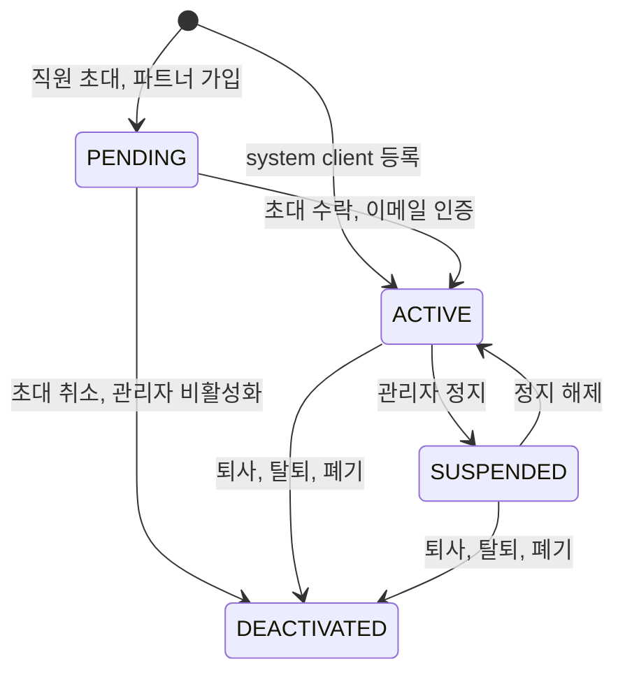

# 도메인

Auth의 용어, 정책 수치, 규칙, 감사·알림을 정의합니다. 다른 문서는 여기 있는 값을 다시 쓰지 않고 정책 이름이나 규칙 ID로 참조합니다.

- 정책 수치는 `policy.xxx` 이름으로 참조합니다. 예: [`policy.access-token-ttl`](#2-정책-값)
- 규칙은 ID로 참조합니다. 예: [`SES-02`](#6-세션-규칙-ses)

## 1. 용어

| 용어 | 뜻 |
|---|---|
| **realm** | 인증 도메인. 로그인 방식, 계정 저장소, 토큰 issuer의 경계. `internal`, `partner`, `customer` |
| **principal** | 인증 주체(계정). 공통 `principal` 테이블의 행 하나이며 id는 타입과 관계없이 전역에서 유일 |
| **principal type** | 계정 종류. `employee`(본사 직원), `system`(마이크로서비스), `partner`(점주), `customer`(고객, 보류). 생성 후 바뀌지 않음 |
| **principal key** | `(principalType, principalId)` 쌍. 서비스는 항상 이 쌍으로 주체를 다룸. 문자열 형식은 `{type}:{id}` (예: `employee:42`) |
| **profile** | 타입별 계정 정보 (`employee_profile`, `partner_profile`, `customer_profile`, `system_client`) |
| **credential** | 인증 수단. 방식별로 테이블을 나눔 (`password_credential`, 추후 `external_identity` 등) |
| **audience** | 토큰을 받는 서비스. `wms`, `catalog`, `store`, `auth` |
| **role** | audience별 권한 묶음. 항상 `{audience}:{code}` 형식 (예: `wms:inbound_manager`) |
| **system role** | `auth:owner`, `auth:admin`. 관리 화면에서 만들거나 고칠 수 없음 |
| **일반 role** | system role을 뺀 모든 role. `auth:partner_reader` 같은 `auth` audience role도 포함 |
| **owner** | `auth:owner`를 가진 직원. 항상 정확히 한 명 |
| **admin** | `auth:admin`을 가진 직원 |
| **verification** | 특정 목적으로 발급한 1회용 비밀값 (초대, 가입 인증, 재설정, owner 양도) |
| **refresh 세션** | 로그인 한 번에 해당하는 세션. 행 하나가 rotation으로 이어지는 refresh token 전체를 대표함 |
| **system client** | 서비스 간 호출용 계정. principal type은 `system` |

### 1.1 realm과 principal type

| realm | 허용 principal type | 로그인 방식 | 가입 방식 |
|---|---|---|---|
| `internal` | `employee` | 이메일 + 비밀번호 | admin 초대 |
| `internal` | `system` | client credentials | owner·admin 등록 |
| `partner` | `partner` | 이메일 + 비밀번호 | 셀프 가입 + 이메일 인증 |
| `customer` | `customer` | (보류) | (보류) |

- **DOM-01** realm과 principal type은 위 표의 조합만 허용합니다. 토큰 발급과 검증 모두 이 표를 따릅니다.
- **DOM-02** 같은 사람이라도 realm이 다르면 별개의 principal입니다. 이메일 유일성은 타입(=realm) 단위입니다.
- **DOM-03** role code는 `^[a-z][a-z0-9_]*$`를 따릅니다. audience code도 같은 형식입니다.
- **DOM-04** 파트너에게는 role을 부여하지 않습니다. 매장과 점주의 관계는 Store 서비스가 관리합니다.

## 2. 정책 값

코드는 이 이름을 설정 키나 상수 이름의 기준으로 씁니다.

| 이름 | 값 | 설명 |
|---|---|---|
| `policy.access-token-ttl` | 10분 | access token, system token 공통 |
| `policy.refresh-idle-ttl` | 8시간 | refresh 세션. 갱신할 때마다 다시 8시간 |
| `policy.refresh-absolute-ttl` | 7일 | 최초 로그인 기준. 연장 불가 |
| `policy.rotation-grace` | 30초 | 교체 직후 직전 토큰을 동시 요청으로 보는 시간 ([SES-03](#6-세션-규칙-ses)) |
| `policy.clock-skew` | 30초 | 서비스가 `exp`·`iat`를 검증할 때 허용하는 시계 오차 |
| `policy.login-lock-threshold` | 5회 | 연속 로그인 실패 횟수 |
| `policy.login-lock-duration` | 15분 | 잠금 시간 |
| `policy.password-min-length` | 8자 | |
| `policy.password-max-length` | 128자 | |
| `policy.invitation-ttl` | 72시간 | `EMPLOYEE_INVITATION` |
| `policy.signup-verification-ttl` | 24시간 | `SIGNUP_VERIFICATION` |
| `policy.password-reset-ttl` | 30분 | `PASSWORD_RESET` |
| `policy.owner-transfer-ttl` | 72시간 | `OWNER_TRANSFER` |
| `policy.secret-bytes` | 32바이트 | refresh token, verification 토큰, client secret의 난수 길이 |
| `policy.signing-key-size` | RSA 3072비트 | 서명 키 |
| `policy.jwks-cache-max-age` | 300초 | JWKS 응답의 `Cache-Control: max-age` |
| `policy.session-retention` | 30일 | 만료·폐기된 refresh 세션 보관 |
| `policy.verification-retention` | 30일 | 만료·사용·무효화된 verification 보관 |
| `policy.audit-retention` | 1년 | 감사 로그 보관 |
| `policy.audit-query-max-range` | 90일 | 감사 로그 한 번 조회 기간 상한 |
| `policy.audit-query-default-range` | 7일 | 기간을 주지 않았을 때 |
| `policy.cleanup-schedule` | 매일 04:00 KST | 정리 배치 ([AUD-05](#11-감사와-알림-aud)) |
| `policy.rate-limit` | 결정 필요 | 인증 없이 호출하는 API의 IP 단위 요청 제한 한도 |

## 3. 계정 상태 규칙 (ACC)

- **ACC-01** 상태는 `PENDING`, `ACTIVE`, `SUSPENDED`, `DEACTIVATED` 네 가지이며 위 전이만 허용합니다. 허용되지 않는 전이는 `INVALID_STATE`입니다.
- **ACC-02** 로그인 실패 잠금은 상태가 아니라 `locked_until`로 표현합니다. 시간이 지나면 자동으로 풀립니다.
- **ACC-03** `SUSPENDED`로 바뀌면 그 principal의 모든 refresh 세션을 폐기합니다 (`ACCOUNT_SUSPENDED`).
- **ACC-04** `DEACTIVATED`는 되돌릴 수 없으며, 한 트랜잭션에서 다음을 처리합니다.
  - 모든 refresh 세션 폐기 (`ACCOUNT_DEACTIVATED`)
  - `password_credential`, `principal_role`, `external_identity` 삭제
  - 살아 있는 verification 무효화
  - profile 개인정보 파기: 이메일 `deleted+{id}@invalid.local`, 이름 `탈퇴 사용자`, 전화번호·주소·사업자등록번호 `NULL`
  - system client는 `client_id`를 `deleted-{id}`로 바꾸고 `client_secret_hash`를 `NULL`로 지움. 같은 `client_id`로 다시 등록할 수 있게 하기 위해서
  - `principal` 행은 남김 (감사 로그와 다른 서비스가 id를 참조)
- **ACC-05** 계정은 물리 삭제하지 않습니다. 이메일이 파기되므로 같은 이메일로 다시 가입하거나 초대할 수 있습니다.
- **ACC-06** 초대 취소는 `PENDING` 직원을 `DEACTIVATED`로 바꾸는 것이며 [ACC-04](#3-계정-상태-규칙-acc)를 따릅니다.
- **ACC-07** 이메일(로그인 ID)은 수정 API로 바꿀 수 없습니다. 이메일 변경은 `EMAIL_CHANGE` verification과 함께 추후 제공합니다.

## 4. 비밀번호 규칙 (PWD)

- **PWD-01** 길이는 `policy.password-min-length` 이상 `policy.password-max-length` 이하입니다.
- **PWD-02** 문자 조합은 강제하지 않습니다.
- **PWD-03** 이메일과 같은 비밀번호는 거부합니다.
- **PWD-04** 해시는 argon2id입니다. 인코딩 문자열에 파라미터가 포함됩니다.
- **PWD-05** 비밀번호 강제 변경 기능은 없습니다. 관리자는 임시 비밀번호를 발급하지 않고 재설정 메일을 보냅니다.
- **PWD-06** 로그인 상태의 비밀번호 변경은 현재 비밀번호를 확인하고, 현재 세션을 **제외한** 모든 세션을 폐기합니다 (`PASSWORD_CHANGED`).
- **PWD-07** 재설정(찾기)으로 바꾸면 **모든** 세션을 폐기하고, 로그인 실패 횟수와 잠금을 초기화합니다 (`PASSWORD_RESET`).
- **PWD-08** 본인 확인용 현재 비밀번호가 틀리면 `401`이 아니라 `400 CURRENT_PASSWORD_MISMATCH`로 응답합니다. 앱은 `401`을 받으면 로그아웃하기 때문입니다.

## 5. 로그인 규칙 (LGN)

- **LGN-01** 검증 순서
  1. IP 요청 제한, 계정 잠금(`locked_until`) 확인 → `TOO_MANY_ATTEMPTS`
  2. realm에 맞는 profile에서 이메일로 조회 (internal → `employee_profile`, partner → `partner_profile`)
  3. 비밀번호 검증. 실패하면 `failed_login_count` 증가, `policy.login-lock-threshold`에 도달하면 `policy.login-lock-duration` 동안 잠금 → `INVALID_CREDENTIALS`
  4. 계정 상태 확인 ([LGN-03](#5-로그인-규칙-lgn))
  5. `failed_login_count` 초기화, refresh 세션 생성, 토큰 발급
- **LGN-02** 계정 존재 여부를 드러내지 않습니다.
  - 계정이 없어도 가짜 해시로 비밀번호 검증을 수행해 응답 시간을 맞춥니다.
  - 2번과 3번 실패는 같은 코드와 메시지입니다.
  - 계정 잠금과 IP 요청 제한은 같은 `TOO_MANY_ATTEMPTS`입니다.
- **LGN-03** 상태별 응답은 비밀번호가 맞았을 때만 구분합니다.

  | 상태 | 응답 |
  |---|---|
  | `ACTIVE` | 정상 |
  | `PENDING` | `EMAIL_NOT_VERIFIED` (파트너 이메일 미인증) |
  | `SUSPENDED` | `ACCOUNT_SUSPENDED` |
  | `DEACTIVATED` | `INVALID_CREDENTIALS` (없는 계정과 같게) |

- **LGN-04** 가입, 가입 인증 메일 재발송, 비밀번호 찾기도 계정 존재 여부와 관계없이 같은 응답을 줍니다. 이미 가입된 이메일로 가입하면 "이미 가입된 계정" 안내 메일을 보냅니다.

## 6. 세션 규칙 (SES)

- **SES-01** refresh 세션은 로그인 한 번에 한 행입니다. 갱신할 때 새 행을 만들지 않고 같은 행의 토큰 해시를 교체합니다. 토큰의 `sid`는 이 행의 id입니다.
- **SES-02** refresh token은 `policy.secret-bytes` 난수이며, DB에는 SHA-256 해시만 저장합니다.
- **SES-03** 갱신 판정
  | 제시된 토큰 | 조건 | 결과 |
  |---|---|---|
  | 현재 토큰과 일치 | 세션 유효 | 교체 (`previous ← current`, `current ← 새 해시`), 만료를 `policy.refresh-idle-ttl`만큼 연장하되 `absolute_expires_at`을 넘지 않음 |
  | 직전 토큰과 일치 | 교체 후 `policy.rotation-grace` 이내 | `TOKEN_ROTATED`. 세션 유지 |
  | 직전 토큰과 일치 | `policy.rotation-grace` 초과 | 재사용으로 보고 세션 폐기 (`REUSE_DETECTED`) → `SESSION_REVOKED` |
  | 일치 없음, 만료, 폐기 | | `SESSION_EXPIRED` |

  판정 순서: 먼저 현재·직전 해시로 세션을 찾고, 세션이 폐기됐거나 만료됐으면 어느 토큰이든 `SESSION_EXPIRED`입니다. 재사용 탐지는 살아 있는 세션에만 적용합니다.
- **SES-04** 교체는 "현재 해시가 맞을 때만"을 원자적으로 처리합니다. 조회 후 비교해서 저장하면 안 됩니다.
- **SES-05** 갱신할 때마다 계정 상태와 role을 다시 조회합니다. `ACTIVE`가 아니면 `SESSION_EXPIRED`로 거부합니다. 상태가 바뀔 때 세션은 이미 폐기되므로([ACC-03](#3-계정-상태-규칙-acc), [ACC-04](#3-계정-상태-규칙-acc)) 이 검사는 방어용이며 세션을 따로 폐기하지 않습니다. role 변경은 다음 갱신 때 토큰에 반영됩니다.
- **SES-06** 폐기 사유(`revoke_reason`)

  | 값 | 상황 |
  |---|---|
  | `LOGOUT` | 로그아웃 |
  | `REUSE_DETECTED` | [SES-03](#6-세션-규칙-ses) 재사용 탐지 |
  | `PASSWORD_RESET` | [PWD-07](#4-비밀번호-규칙-pwd) |
  | `PASSWORD_CHANGED` | [PWD-06](#4-비밀번호-규칙-pwd) |
  | `ACCOUNT_SUSPENDED` | [ACC-03](#3-계정-상태-규칙-acc) |
  | `ACCOUNT_DEACTIVATED` | [ACC-04](#3-계정-상태-규칙-acc) |
  | `OWNER_TRANSFERRED` | [GOV-09](#8-관리-권한-규칙-gov) |
  | `OWNER_RECOVERY` | [GOV-12](#8-관리-권한-규칙-gov) 수동 복구 |

- **SES-07** 세션을 폐기해도 이미 발급된 access token은 `policy.access-token-ttl`까지 유효합니다. 즉시 차단은 지원하지 않습니다 ([ADR-0004](adr/0004-no-immediate-revocation.md)).
- **SES-08** 로그아웃은 세션이 없거나 이미 만료됐어도 성공으로 응답합니다.

## 7. verification 규칙 (VER)

- **VER-01** 목적별 정책

  | purpose | method | 유효 시간 | 소비 시 동작 |
  |---|---|---|---|
  | `EMPLOYEE_INVITATION` | EMAIL | `policy.invitation-ttl` | `password_credential` 생성, `ACTIVE` 전환 |
  | `SIGNUP_VERIFICATION` | EMAIL | `policy.signup-verification-ttl` | `ACTIVE` 전환 |
  | `PASSWORD_RESET` | EMAIL | `policy.password-reset-ttl` | [PWD-07](#4-비밀번호-규칙-pwd) |
  | `OWNER_TRANSFER` | EMAIL | `policy.owner-transfer-ttl` | [GOV-09](#8-관리-권한-규칙-gov) |
  | `EMAIL_CHANGE` (추후) | EMAIL | 미정 | `payload`의 새 이메일로 변경 |

- **VER-02** 토큰은 `policy.secret-bytes` 난수이며 SHA-256 해시만 저장합니다.
- **VER-03** `(principal, purpose)`마다 살아 있는 토큰은 하나입니다. 재발송하면 이전 토큰을 먼저 무효화합니다.
- **VER-04** 만료, 사용, 무효화된 토큰은 모두 `VERIFICATION_EXPIRED`로 응답합니다.
- **VER-05** 토큰은 URL 경로나 쿼리에 넣지 않고 요청 본문으로 받습니다. 메일 링크의 토큰은 앱 화면 주소에만 들어갑니다.
- **VER-06** 초대 조회는 토큰을 소비하지 않습니다. 조회 응답의 이메일과 전화번호는 마스킹합니다 ([SEC-02](#12-민감정보-sec)).
- **VER-07** 가입 인증 후에는 자동 로그인하지 않습니다. 메일 링크가 가입한 기기와 다른 기기에서 열릴 수 있기 때문입니다.
- **VER-08** 발송 대상 주소는 `target`에 스냅샷으로 남깁니다.

## 8. 관리 권한 규칙 (GOV)

- **GOV-01** 관리 역할

  | role | 인원 | 부여 방법 | 할 수 있는 일 |
  |---|---|---|---|
  | `auth:owner` | 정확히 1명 | 부여 불가, 양도만 | 전부. admin 임명·해임, audience 추가, 감사 로그 조회, owner 양도 |
  | `auth:admin` | 여러 명 | owner만 부여·회수 | 계정 관리, 일반 role 부여·회수, role 정의 관리, system client 관리 |

- **GOV-02** admin은 owner·admin 계정에 대해 **변경 작업을 할 수 없습니다.** role 부여·회수, 정보 수정, 정지, 해제, 비활성화, 초대 재발송·취소, 재설정 메일 발송 모두 해당합니다. 조회는 가능합니다. 위반은 `PROTECTED_ACCOUNT`입니다.
- **GOV-03** owner 계정은 누구도 정지하거나 비활성화할 수 없습니다. owner 자신도 마찬가지이며, 먼저 양도해야 합니다.
- **GOV-04** 자기 자신에게 role을 부여할 수 없습니다 (`SELF_GRANT_NOT_ALLOWED`).
- **GOV-05** `auth:admin` 부여·회수는 owner만 할 수 있습니다. `auth:owner`는 부여·회수 API로 다룰 수 없고 양도만 가능합니다. 위반은 `FORBIDDEN`입니다.
- **GOV-06** 대상 principal type별로 부여할 수 있는 role

  | 대상 | 부여 가능 |
  |---|---|
  | `employee` | 모든 일반 role, owner가 부여하는 `auth:admin` |
  | `system` | 일반 role만 |
  | `partner` | 없음 ([DOM-04](#11-realm과-principal-type)) |

- **GOV-07** `PENDING` 직원에게는 role을 부여할 수 있습니다(초대 시 함께 지정). `SUSPENDED`, `DEACTIVATED`에는 부여할 수 없습니다 (`INVALID_STATE`).
- **GOV-08** 부여는 멱등입니다. 이미 가진 role은 무시하고, 가지지 않은 role을 회수해도 성공입니다. 여러 role을 한 번에 부여할 때 하나라도 실패하면 전체를 적용하지 않습니다.
- **GOV-09** owner 양도
  - 대상은 `ACTIVE` 직원이어야 하며 자기 자신은 안 됩니다.
  - `OWNER_TRANSFER` verification은 **대상** principal에 발급합니다. 진행 중인 양도는 전체에서 하나만 있을 수 있으며, 새 요청 때 살아 있는(만료 전, 미사용, 미무효) `OWNER_TRANSFER`가 있으면 `INVALID_STATE`입니다.
  - 대상이 **본인으로 로그인한 상태에서** 수락해야 합니다. 링크만 가로챈 사람이 owner가 되는 것을 막기 위해서입니다.
  - 수락하면 한 트랜잭션에서 기존 owner의 `auth:owner` 회수, 대상에게 부여, 감사 로그 기록, 기존 owner의 모든 세션 폐기(`OWNER_TRANSFERRED`)를 처리합니다.
  - 기존 owner는 role 없는 직원이 됩니다. 현재 owner는 수락 전까지 취소할 수 있습니다.
- **GOV-10** owner는 DB 부분 UNIQUE 인덱스로 한 명만 존재하도록 보장합니다. owner가 없어지는 상황(비활성화, 회수)은 허용하지 않습니다.
- **GOV-11** 부트스트랩: Auth가 기동할 때 owner가 없으면 `BOOTSTRAP_OWNER_EMAIL`로 직원(`PENDING`)을 만들고 `auth:owner`를 부여한 뒤 초대를 보냅니다.
  - owner가 `PENDING`이고 초대가 만료됐으면 재기동할 때 다시 발급합니다.
  - owner가 `ACTIVE`이면 설정값을 무시합니다. 설정값으로 owner를 교체할 수 없습니다.
  - 인스턴스 여러 대가 동시에 기동해도 한 번만 실행돼야 합니다.
  - 감사 로그는 `EMPLOYEE_INVITED`, `ROLE_GRANTED`이며 `actor_id`는 `NULL`입니다.
- **GOV-12** owner 복구(퇴사 등으로 양도 불가)는 앱 기능이 아니라 인프라 관리자의 수동 SQL 절차입니다. 복구해도 [GOV-10](#8-관리-권한-규칙-gov)과 감사 로그 규칙은 같습니다.
- **GOV-13** role 정의
  - admin과 owner가 등록·수정·삭제합니다. 등록만으로는 아무에게도 권한이 생기지 않습니다.
  - code와 audience는 등록 후 바꿀 수 없습니다. 이름과 설명만 수정합니다.
  - system role은 수정·삭제할 수 없습니다 (`FORBIDDEN`).
  - 부여된 principal이 있으면 삭제를 거부하고(`ROLE_IN_USE`), 확인을 받아 일괄 회수한 뒤 삭제할 수 있습니다.
  - audience 추가는 owner만 가능합니다. audience 삭제는 없습니다.
- **GOV-14** 관리 API의 인가는 지금 role 이름(`auth:owner`, `auth:admin`)으로 검사합니다. 권한 단위(`ACCOUNT_INVITE` 등) 검사는 필요해질 때 도입합니다.

## 9. system client 규칙 (CLI)

- **CLI-01** `client_id`는 `svc-{서비스명}` 형식입니다.
- **CLI-02** secret은 `policy.secret-bytes` 난수이며, 등록·재발급 응답에서 **한 번만** 내려주고 이후에는 SHA-256 해시만 남깁니다. 난수라서 느린 해시가 필요 없습니다.
- **CLI-03** secret을 재발급하면 기존 secret은 즉시 무효입니다. 이미 발급된 system token은 `policy.access-token-ttl`까지 유효합니다.
- **CLI-04** system client는 등록 즉시 `ACTIVE`입니다. 폐기는 계정 비활성화로 합니다.
- **CLI-05** system token에는 refresh token이 없습니다. 만료되면 다시 발급받습니다.

## 10. 서비스 연계 규칙 (INT)

- **INT-01** 파트너 조회는 `ACTIVE` 파트너만 대상으로 합니다. 응답은 principal id, 이름, 마스킹된 전화번호입니다. 매장 할당 전 본인 확인용입니다.
- **INT-02** Auth는 매장-점주 관계를 저장하지 않습니다. 파트너가 탈퇴해도 Auth는 Store 데이터를 정리하지 않으며, Store가 비활성화된 파트너를 처리합니다.

## 11. 감사와 알림 (AUD)

- **AUD-01** action 목록

  | action | 기록 시점 | owner 알림 |
  |---|---|---|
  | `LOGIN_SUCCEEDED`, `LOGIN_FAILED`, `ACCOUNT_LOCKED` | 로그인 | - |
  | `SESSION_REVOKED` | 로그아웃, 재사용 탐지 등 세션 폐기 | - |
  | `PASSWORD_CHANGED`, `PASSWORD_RESET` | 비밀번호 변경·재설정 | - |
  | `PASSWORD_RESET_REQUESTED` | 관리자의 재설정 메일 발송 | 일일 요약 |
  | `EMPLOYEE_INVITED` | 직원 초대 | 일일 요약 (`auth` audience role 포함 시 즉시) |
  | `INVITATION_ACCEPTED`, `PARTNER_SIGNED_UP`, `EMAIL_VERIFIED` | 계정 생성 | - |
  | `PROFILE_UPDATED` | 본인·관리자의 정보 수정 | - |
  | `ACCOUNT_SUSPENDED`, `ACCOUNT_REACTIVATED`, `ACCOUNT_DEACTIVATED` | 상태 변경 | 일일 요약 |
  | `ROLE_GRANTED`, `ROLE_REVOKED` | role 부여·회수 | 일일 요약 (`auth` audience role이면 즉시) |
  | `ROLE_DEFINED`, `ROLE_UPDATED` | role 정의 등록·수정 | - |
  | `ROLE_DELETED` | role 정의 삭제 (일괄 회수 포함) | 즉시 |
  | `AUDIENCE_CREATED` | audience 추가 | 즉시 |
  | `SYSTEM_CLIENT_REGISTERED`, `CLIENT_SECRET_ROTATED` | system client 관리 | 즉시 |
  | `OWNER_TRANSFER_REQUESTED`, `OWNER_TRANSFER_CANCELLED`, `OWNER_TRANSFERRED` | owner 양도 | 즉시 |

- **AUD-02** admin 임명·해임은 `auth` audience role 부여·회수이므로 즉시 알림입니다.
- **AUD-08** 기록 단위
  - 요청 하나에 action 하나를 기본으로 합니다. 여러 role을 한 번에 부여하면 `ROLE_GRANTED` 한 건에 `detail.roles`로 담습니다.
  - `SESSION_REVOKED`는 로그아웃과 재사용 탐지에만 남깁니다. 정지·비활성화·비밀번호 변경·양도로 함께 폐기된 세션은 그 작업의 action에 `detail.revokedSessions`(개수)로 남깁니다.
  - `LOGIN_FAILED`에서 계정을 찾지 못하면 `actor_id`, `target_id`는 `NULL`이고 `detail`에는 realm만 남깁니다. 입력한 이메일은 남기지 않습니다.
- **AUD-03** 즉시 알림은 발생하는 대로 메일을 보내고, 일일 요약은 하루 한 번 모아서 보냅니다. 받는 사람은 owner입니다. owner 양도가 완료되면 이전 owner에게도 완료 메일을 보냅니다.
- **AUD-04** 감사 로그는 owner만 조회합니다. 최신순이며 조회 기간은 `policy.audit-query-max-range` 이하입니다.
- **AUD-05** 정리 배치(`policy.cleanup-schedule`)
  - refresh 세션: `absolute_expires_at` 또는 `revoked_at` 후 `policy.session-retention` 경과
  - verification: `expires_at`, `consumed_at`, `invalidated_at` 중 하나 후 `policy.verification-retention` 경과
  - 감사 로그: 발생 후 `policy.audit-retention` 경과
  - principal: 삭제하지 않음 ([ACC-05](#3-계정-상태-규칙-acc))
- **AUD-06** 감사 로그에는 FK를 두지 않습니다. 계정 개인정보가 파기돼도 기록은 남아야 합니다.
- **AUD-07** 감사 로그 `detail`에 비밀번호, 토큰 원문, 수정 전후 개인정보 값을 넣지 않습니다. 정보 수정은 바뀐 필드 이름만 남깁니다.

## 12. 민감정보 (SEC)

- **SEC-01** 해시로만 저장: 비밀번호(argon2id), refresh token·verification 토큰·client secret(SHA-256). 원문은 어디에도 저장하지 않습니다.
- **SEC-02** 응답 마스킹: 초대 조회와 파트너 조회 응답의 이메일·전화번호. 예: `ki***@dozycoffee.com`, `010-****-5678`
- **SEC-03** 로그 금지: 비밀번호, 모든 토큰 원문, 쿠키 값, `Authorization` 헤더. 목록 조회의 검색어 `q`도 접근 로그에서 가립니다.
- **SEC-04** 토큰에 이름, 이메일 같은 개인정보를 넣지 않습니다. payload는 누구나 디코딩할 수 있습니다.
- **SEC-05** 토큰·해시 비교는 상수 시간으로 합니다. 난수는 `SecureRandom`만 씁니다.
